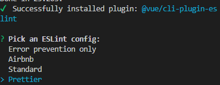

# eslint配置
>配置`eslint prettier airbnb-base`guize 

## vue-cli 项目配置
1. `vue add eslint`命令下载`vue-cli`的`eslint`插件，选择`Prettier`配置。
     <center>eslint-config</center>

2. 生成完后，下载`yarn add -D eslint-config-airbnb-base`依赖包，修改`.eslintrc.js`配置
```ts 
 module.exports = {
  root: true,
  env: {
    node: true
  },
  //  扩展airbnb-base，并将'eslint:recommended'删除
  extends: ["airbnb-base", "plugin:vue/essential", "@vue/prettier"],
  parserOptions: {
    parser: "babel-eslint"
  },
  rules: {
    "no-console": process.env.NODE_ENV === "production" ? "warn" : "off",
    "no-debugger": process.env.NODE_ENV === "production" ? "warn" : "off",
    "camelcase":1,
    "eqeqeq":1,
    "import/no-dynamic-require":0,
    "global-require":0,
    "import/no-unresolved": [
      2,
      {
        ignore: ["^@/"] // @ 是设置的路径别名
      }
    ]
  }
};
```
3. 修改`vue.config.js`配置，增加`eslint-loader`
```ts 
chainWebpack: config => {
config.module
    .rule("eslint")
    .test(/\.(js|vue)$/)
    .pre()
    .include.add(path.resolve(__dirname, "src"))
    .end()
    .use("eslint")
    .loader("eslint-loader");
},
```
## 一般配置
1. 安装`eslint prettier`，`yarn add eslint prettier -D`
2. 安装`airbnb-base`，`yarn add eslint-config-airbnb -D`
3. 安装`eslint-config-prettier`（禁用ESLint格式）和`eslint-plugin-prettier`（允许ESLint在我们键入时显示格式错误），`yarn add eslint-config-prettier eslint-plugin-prettier-D`
4. 生成`.eslintrc.js`配置文件
```ts 
 module.exports = {
  root: true,
  env: {
    node: true
  },
  extends: [
    'airbnb-base',
    'prettier'
  ],
  plugins:['prettier']
  parserOptions: {
    ecmaVersion: 2020
  },
  rules: {
    'prettier/prettier': ['error'] 
  }
}
```
5. 同时将`eslint-loader`配置到`webpack`的`module`中