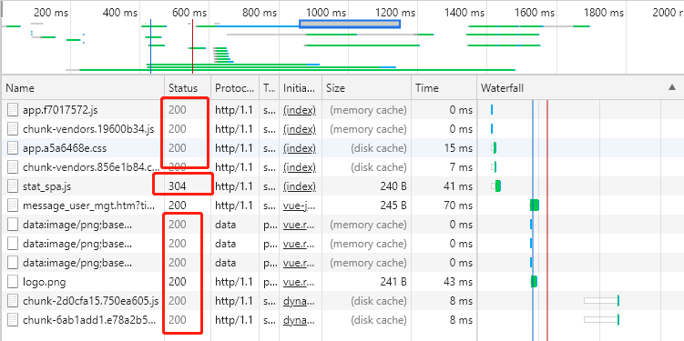

# HTTP

> HTTP 协议全称`超文本传输协议`，主流使用的HTTP/1.1 是基于`TCP/IP` 协议的应用层协议，它不涉及数据包（packet）传输，主要规定了客户端和服务器之间的通信格式，默认使用 80 端口。

## HTTP 报文结构

报文一般包括：`通用头部`，`请求/响应头部`，`请求/响应体`

### 通用头部

```
Request Url: 请求的web服务器地址
Request Method: 请求方式（Get、POST、OPTIONS、PUT、HEAD、DELETE、CONNECT、TRACE）
Status Code: 请求的返回状态码，如200代表成功
Remote Address: 请求的远程服务器地址（会转为IP）
Referrer Policy:Referrer策略
```


**状态码**

这里面最常用到的就是状态码，很多时候都是通过状态码来判断，如（列举几个最常见的）：
```
200——表明该请求被成功地完成，所请求的资源发送回客户端
304——自从上次请求后，请求的网页未修改过，请客户端使用本地缓存
400——客户端请求有错（譬如可以是安全模块拦截或参数错误）
401——请求未经授权
403——禁止访问（譬如可以是未登录时禁止）
404——资源未找到
500——服务器内部错误
503——服务不可用
504——响应超时
```
再列举下大致不同范围状态的意义
```
1xx——指示信息，表示请求已接收，继续处理
2xx——成功，表示请求已被成功接收、理解、接受
3xx——重定向，要完成请求必须进行更进一步的操作
4xx——客户端错误，请求有语法错误或请求无法实现
5xx——服务器端错误，服务器未能实现合法的请求
```

### 请求头部

> 常用的请求头部

```
Accept: 接收类型，表示浏览器支持的MIME类型（对标服务端返回的Content-Type）
Accept-Encoding：浏览器支持的压缩类型,如gzip等,超出类型不能接收
Content-Type：客户端发送出去实体内容的类型
Cache-Control: 指定请求和响应遵循的缓存机制，如no-cache
If-Modified-Since：对应服务端的Last-Modified，用来匹配看文件是否变动，只能精确到1s之内，http1.0中
Expires：缓存控制，在这个时间内不会请求，直接使用缓存，http1.0，而且是服务端时间
Max-age：代表资源在本地缓存多少秒，有效时间内不会请求，而是使用缓存，http1.1中
If-None-Match：对应服务端的ETag，用来匹配文件内容是否改变（非常精确），http1.1中
Cookie: 有cookie并且同域访问时会自动带上
Connection: 当浏览器与服务器通信时对于长连接如何进行处理,如keep-alive
Host：请求的服务器URL
Origin：最初的请求是从哪里发起的（只会精确到端口）,Origin比Referer更尊重隐私
Referer：该页面的来源URL(适用于所有类型的请求，会精确到详细页面地址，csrf拦截常用到这个字段)
User-Agent：用户客户端的一些必要信息，如UA头部等
```


> 截图中的`Sec-Fetch-*`请求头网络请求的元数据描述。服务端可以根据这些补充数据做精确判断请求的合法性，杜绝非法请求和攻击，提高 web 服务的安全性。这些请求头是浏览器自己加上去的，不能被篡改的。由于是 2019 年发布的新草案，不做过多解释。

### 响应头部

> 常用的响应头部

```
Access-Control-Allow-Headers: 服务器端允许的请求Headers
Access-Control-Allow-Methods: 服务器端允许的请求方法
Access-Control-Allow-Origin: 服务器端允许的请求Origin头部（譬如为*）
Content-Type：服务端返回的实体内容的类型
Date：数据从服务器发送的时间
Cache-Control：告诉浏览器或其他客户，什么环境可以安全的缓存文档
Last-Modified：请求资源的最后修改时间
Expires：应该在什么时候认为文档已经过期,从而不再缓存它
Max-age：客户端的本地资源应该缓存多少秒，开启了Cache-Control后有效
ETag：请求变量的实体标签的当前值
Set-Cookie：设置和页面关联的cookie，服务器通过这个头部把cookie传给客户端
Keep-Alive：如果客户端有keep-alive，服务端也会有响应（如timeout=38）
Server：服务器的一些相关信息
```


一般来说，请求头部和响应头部是匹配分析的。<br>

譬如，请求头部的 `Accept` 要和响应头部的 `Content-Type` 匹配，否则会报错<br>
譬如，跨域请求时，请求头部的 `Origin` 要匹配响应头部的 `Access-Control-Allow-Origin`，否则会报跨域错误<br>
譬如，在使用缓存时，请求头部的 `If-Modified-Since`、`If-None-Match` 分别和响应头部的 `Last-Modified`、`ETag` 对应。

### 请求体

`http` 请求时，除了头部，还有消息实体。一般来说，请求实体中会将一些需要的参数都放入进入。

注意，仅有 `POST`、`PUT` 以及 `PATCH` 这三个动词时会包含请求体，而 `GET、HEAD、DELETE、CONNECT、TRACE、OPTIONS` 这几个动词时不包含请求体。


### 响应体

响应实体中，就是放服务端需要传给客户端的内容

一般现在的接口请求时，实体中就是对于的信息的 `json` 格式，而像页面请求这种，里面就是直接放了一个 `html` 字符串，然后浏览器自己解析并渲染。


## HTTP/0.9

`HTTP` 最早版本是 1991 年发布的 0.9 版。该版本极其简单，只有一个命令 `GET`，只能回应 HTML 格式的字符串，不能回应别的格式。

```
GET /index.html
```

## HTTP/1.0

1996 年 5 月，HTTP/1.0 版本发布。<br>
首先，任何格式的内容都可以发送。这使得互联网不仅可以传输文字，还能传输图像、视频、二进制文件。这为互联网的大发展奠定了基础。<br>
其次，除了 `GET` 命令，还引入了 `POST` 命令和 `HEAD` 命令，丰富了浏览器与服务器的互动手段。<br>
再次，HTTP 请求和回应的格式也变了。除了数据部分，每次通信都必须包括`头信息`（HTTP header），用来描述一些元数据。<br>
其他的新增功能还包括`状态码`（status code）、多字符集支持、多部分发送（multi-part type）、权限（authorization）、缓存（cache）、内容编码（content encoding）等。<br>

> http 1.0 请求的例子

```
GET / HTTP/1.0
User-Agent: Mozilla/5.0 (Macintosh; Intel Mac OS X 10_10_5)
Accept: */*
```

可以看到，这个格式与 0.9 版有很大变化。第一行是请求命令，必须在尾部添加协议版本（HTTP/1.0）。后面就是多行头信息，描述客户端的情况。

> http 1.0 响应的例子

```
HTTP/1.0 200 OK
Content-Type: text/plain
Content-Length: 137582
Expires: Thu, 05 Dec 1997 16:00:00 GMT
Last-Modified: Wed, 5 August 1996 15:55:28 GMT
Server: Apache 0.84

<html>
  <body>Hello World</body>
</html>
```

回应的格式是"头信息 + 一个空行（\r\n） + 数据"。其中，第一行是"协议版本 + 状态码（status code） + 状态描述"。

### Content-Type 字段

1.0 版规定，头信息必须是 ASCII 码，后面的数据可以是任何格式。因此，服务器回应的时候，必须告诉客户端，数据是什么格式，这就是 Content-Type 字段的作用。

```
text/plain
text/html
text/css
image/jpeg
image/png
image/svg+xml
audio/mp4
video/mp4
application/javascript
application/pdf
application/zip
application/atom+xml
```

这些数据类型总称为`MIME type`，每个值包括一级类型和二级类型，之间用斜杠分隔。

除了预定义的类型，浏览器厂商也可以自定义类型。

```
application/vnd.debian.binary-package
```

上面的类型表明，发送的是 Debian 系统的二进制数据包。

`MIME type` 还可以在尾部使用分号，添加参数。

```
Content-Type: text/html; charset=utf-8
```

上面的类型表明，发送的是网页，而且编码是 UTF-8。

客户端请求的时候，可以使用 Accept 字段声明自己可以接受哪些数据格式。

```
Accept: */*
```

上面代码中，客户端声明自己可以接受任何格式的数据。

### HTTP/1.0缺点

`HTTP/1.0` 版的主要缺点是，每个 `TCP` 连接只能发送一个请求。发送数据完毕，连接就关闭，如果还要请求其他资源，就必须再新建一个 `TCP` 连接。

`TCP` 连接的新建成本很高，因为需要客户端和服务器三次握手，并且开始时发送速率较慢（slow start）。所以，HTTP 1.0 版本的性能比较差。随着网页加载的外部资源越来越多，这个问题就愈发突出了。

为了解决这个问题，有些浏览器在请求时，用了一个非标准的 `Connection` 字段。

```
Connection: keep-alive
```

这个字段要求服务器不要关闭 `TCP` 连接，以便其他请求复用。服务器同样回应这个字段。

```
Connection: keep-alive
```

一个可以复用的 `TCP` 连接就建立了，直到客户端或服务器主动关闭连接。但是，这不是标准字段，不同实现的行为可能不一致，因此不是根本的解决办法。

## HTTP 1.1

1997 年 1 月，`HTTP/1.1` 版本发布，只比 1.0 版本晚了半年。它进一步完善了 HTTP 协议，一直用到了 20 多年后的今天，直到现在还是最流行的版本。

### 持久连接

1.1 版的最大变化，就是引入了`持久连接`（persistent connection），即 TCP 连接默认不关闭，可以被多个请求复用，不用声明` Connection: keep-alive`。

客户端和服务器发现对方一段时间没有活动，就可以主动关闭连接。不过，规范的做法是，客户端在最后一个请求时，发送 `Connection: close`，明确要求服务器关闭 TCP 连接。

目前，对于同一个域名，大多数浏览器允许同时建立 `6 个持久连接`。即同一个域名最多有`6 个 TCP 连接`。

### 管道机制

1.1 版还引入了`管道机制`（pipelining），即在同一个 `TCP` 连接里面，客户端可以同时发送多个请求。这样就进一步改进了 `HTTP` 协议的效率。

举例来说，客户端需要请求两个资源。以前的做法是，在同一个 TCP 连接里面，先发送 A 请求，然后等待服务器做出回应，收到后再发出 B 请求。管道机制则是允许浏览器同时发出 A 请求和 B 请求，但是服务器还是按照顺序，先回应 A 请求，完成后再回应 B 请求。

### Content-Length 字段

一个 `TCP` 连接现在可以传送多个回应，势必就要有一种机制，区分数据包是属于哪一个回应的。这就是 `Content-length` 字段的作用，声明本次回应的数据长度。

```
Content-Length: 3495
```

上面代码告诉浏览器，本次回应的长度是 3495 个字节，后面的字节就属于下一个回应了。

在 1.0 版中，`Content-Length` 字段不是必需的，因为浏览器发现服务器关闭了 TCP 连接，就表明收到的数据包已经全了。

### 分块传输编码

使用 `Content-Length` 字段的前提条件是，服务器发送回应之前，必须知道回应的数据长度。

对于一些很耗时的动态操作来说，这意味着，服务器要等到所有操作完成，才能发送数据，显然这样的效率不高。更好的处理方法是，产生一块数据，就发送一块，采用`"流模式"`（stream）取代`"缓存模式"`（buffer）。

因此，1.1 版规定可以不使用 `Content-Length` 字段，而使用`"分块传输编码"`（chunked transfer encoding）。只要请求或回应的头信息有 `Transfer-Encoding` 字段，就表明回应将由数量未定的数据块组成。

```
Transfer-Encoding: chunked
```

每个非空的数据块之前，会有一个 16 进制的数值，表示这个块的长度。最后是一个大小为 0 的块，就表示本次回应的数据发送完了。下面是一个例子。

```
HTTP/1.1 200 OK
Content-Type: text/plain
Transfer-Encoding: chunked

25
This is the data in the first chunk

1C
and this is the second one

3
con

8
sequence

0
```

### 其他功能

1.1 版还新增了许多动词方法：`PUT`、`PATCH`、`HEAD`、 `OPTIONS`、`DELETE`。

另外，客户端请求的头信息新增了`Host`字段，用来指定服务器的域名。

```
Host: www.example.com
```

有了 Host 字段，就可以将请求发往同一台服务器上的不同网站，为虚拟主机的兴起打下了基础。

### HTTP/1.1缺点

虽然 `1.1` 版允许复用 `TCP` 连接，但是同一个 `TCP` 连接里面，所有的数据通信是按次序进行的。服务器只有处理完一个回应，才会进行下一个回应。要是前面的回应特别慢，后面就会有许多请求排队等着。这称为 <strong> "队头堵塞"（Head-of-line blocking）</strong>。

为了避免这个问题，只有两种方法：**一是减少请求数** ，**二是同时多开持久连接**。这导致了很多的网页优化技巧，比如合并脚本和样式表、将图片嵌入 CSS 代码、域名分片（domain sharding）等等。如果 HTTP 协议设计得更好一些，这些额外的工作是可以避免的。


## HTTP 2

2015年，`HTTP/2` 发布。它不叫 HTTP/2.0，是因为标准委员会不打算再发布子版本了，下一个新版本将是 `HTTP/3`。

`HTTP/2 `很好的解决了当下最常⽤的 HTTP/1 所存在的⼀些性能问题，只需要升级到该协议就可以减少很多之前需要做的性能优化⼯作，当然兼容问题以及如何优雅降级应该是国内还不普遍使⽤的原因之⼀。 


### 二进制传输

`HTTP/2` 中所有加强性能的核⼼点在于此，`HTTP/1.1` 版的头信息肯定是文本（ASCII编码），数据体可以是文本，也可以是二进制。`HTTP/2 `则是一个彻底的二进制协议，头信息和数据体都是二进制，并且统称为`"帧"`（frame）：`头信息帧`和`数据帧`。

二进制协议的一个好处是，可以定义额外的帧。`HTTP/2 `定义了近十种帧，为将来的高级应用打好了基础。如果使用文本实现这种功能，解析数据将会变得非常麻烦，二进制解析则方便得多。


### 多路复用

在 `HTTP/1` 中，为了性能考虑，我们会引⼊雪碧图、将⼩图内联、 使⽤多个域名等等的⽅式。这⼀切都是因为浏览器限制了同⼀个域名下的请求数量（Chrome 下⼀般是限制六个连接），当⻚⾯中需要请求很多资源的时候，`队头阻塞`（Head of line blocking）会导致在达到最⼤请求数量时，剩余的资源需要等待其他资源请求完成后才能发起请求。 

在 `HTTP/2` 中，有两个⾮常重要的概念，分别是`帧`（frame）和`流` （stream）。 帧代表着最⼩的数据单位，每个帧会标识出该帧属于哪个流，流也就 是多个帧组成的数据流。 


在 `HTTP/2` 中引⼊了`多路复⽤`的技术。`多路复⽤`，就是在⼀个 TCP 连接中可以存在多条流。换句话说，也就是可以发送多个请求，对端可以通过帧中的标识知道属于哪个请求。通过这个技术，可以避免 `HTTP` 旧版本中的队头阻塞问题，极⼤的提⾼传输性能。

即`多路复用`可以只通过⼀个 `TCP` 连接就可以传输所有的请求数据。`多路复⽤`很好的解决了浏览器限制同⼀个域名下的请求数量的问题，同时也更容易实现`全速传输`，毕竟新开⼀个 TCP 连接都需要慢慢提升传输速度。 

在 HTTP/1 中，因为队头阻塞的原因，你会发现发送请求是长这样的


在 HTTP/2 中，因为可以复用同一个 TCP 连接，你会发现发送请求是长这样的


### Header 压缩 


在 `HTTP/1` 中，我们使⽤⽂本的形式传输 header，在 header 携带 `cookie` 的情况下，或者携带的`jwt token`，可能每次都需要重复传输⼏百到⼏千的字节。 

在 `HTTP/2` 中，使⽤了 `HPACK` 压缩格式对传输的 `header` 进⾏编码，减少了 `header` 的⼤⼩。并在两端维护了索引表，⽤于记录出现过的 `header`，后⾯在传输过程中就可以传输已经记录过的 header 的键名，对端收到数据后就可以通过键名找到对应的值。 

### 服务端推送
`HTTP/2` 允许服务器未经请求，主动向客户端发送资源，这叫做`服务器推送`（server push）。

常见场景是客户端请求一个网页，这个网页里面包含很多静态资源。正常情况下，客户端必须收到网页后，解析HTML源码，发现有静态资源，再发出静态资源请求。其实，服务器可以预期到客户端请求网页后，很可能会再请求静态资源，所以就主动把这些静态资源随着网页一起发给客户端了。

## HTTP 3
2019年9月，`HTTP/3`支持已添加到CloudFlare和Google Chrome。

虽然 `HTTP/2` 解决了很多之前旧版本的问题，但是它还是存在⼀个 巨⼤的问题，虽然这个问题并不是它本身造成的，⽽是底层⽀撑的 `TCP` 协议的问题。 

因为 `HTTP/2` 使⽤了多路复⽤，⼀般来说同⼀域名下只需要使⽤⼀个 `TCP` 连接。当这个连接中出现了丢包的情况，那就会导致 `HTTP/2` 的表现情况反倒不如 `HTTP/1`了。 因为在出现丢包的情况下，整个 `TCP` 都要开始等待重传，也就导致了后⾯的所有数据都被阻塞了。但是对于 `HTTP/1` 来说，可以开启多个 `TCP` 连接，出现这种情况反到只会影响其中⼀个连接，剩余的`TCP`连接还可以正常传输数据

在`HTTP/3`中，将弃用`TCP`协议，改为使用基于`UDP`协议的`QUIC`协议实现。

### QUIC

`QUIC` 虽然基于 `UDP`，但是在原本的基础上新增了很多功能，⽐如`多路复⽤`、`0-RTT`、使⽤ `TLS1.3`加密、`流量控制`、`有序交付`、`重传`等等功能。

- `多路复用`：虽然 HTTP/2 ⽀持了多路复⽤，但是 TCP 协议终究是没有这个功能 的。QUIC 原⽣就实现了这个功能，并且传输的单个数据流可以保证 有序交付且不会影响其他的数据流，这样的技术就解决了之前 TCP 存在的问题。 

- `0-RTT`：通过使⽤类似 TCP 快速打开的技术，缓存当前会话的上下⽂，在下 次恢复会话的时候，只需要将之前的缓存传递给服务端验证通过就可 以进⾏传输了。 

- `纠错机制`: 假如说这次要发送三个包，那么协议会算出这三个包的异或值并单独发出⼀个校验包，也就是总共发出了四个包。 当出现其中的⾮校验包丢包的情况时，可以通过另外三个包计算出丢 失的数据包的内容。 当然这种技术只能使⽤在丢失⼀个包的情况下，如果出现丢失多个包就不能使⽤纠错机制了，只能使⽤重传的⽅式了。 


### 单独拎出来的HTTP缓存
前后端的`http`交互中，使用缓存能很大程度上的提升效率，而且基本上对性能有要求的前端项目都是必用缓存的。

缓存可以简单的划分成两种类型：
 - `强缓存（200 from cache）`
  - 浏览器如果判断本地缓存未过期，就直接使用，无需发起http请求
 - `协商缓存（304）`
  - 浏览器会向服务端发起http请求，然后服务端告诉浏览器文件未改变，让浏览器使用本地缓存




对于协商缓存，使用Ctrl + F5强制刷新可以使得缓存无效

但是对于强缓存，在未过期时，必须更新资源路径才能发起新的请求（更改了路径相当于是另一个资源了，这也是前端工程化中常用到的技巧）

#### 缓存头部简述
那么如何区分强缓存和协商缓存？ 答案是**通过不同的http头部控制**。

先看下这几个头部：
- `If-None-Match/E-tag`
- `If-Modified-Since/Last-Modified`
- `Cache-Control/Max-Age`
- `Pragma/Expires`

这些就是缓存中常用到的头部。

属于强缓存控制的：
```
（http1.1）Cache-Control/Max-Age
（http1.0）Pragma/Expires
```
注意：**Max-Age不是一个头部，它是Cache-Control头部的值**

属于协商缓存控制的：

```
（http1.1）If-None-Match/E-tag
（http1.0）If-Modified-Since/Last-Modified
```
可以看到，上述有提到http1.1和http1.0，这些不同的头部是属于不同http时期的

再提一点，其实HTML页面中也有一个`meta`标签可以控制缓存方案-`Pragma`
```html
<META HTTP-EQUIV="Pragma" CONTENT="no-cache">
```
不过，这种方案还是比较少用到，因为支持情况不佳，譬如缓存代理服务器肯定不支持，所以不推荐。

#### 缓存头部区别

http的发展是从http1.0到http1.1。而在http1.1中，出了一些新内容，弥补了http1.0的不足。

>http1.0中的缓存控制：
- `Pragma`：严格来说，它不属于专门的缓存控制头部，但是它设置no-cache时可以让本地强缓存失效（属于编译控制，来实现特定的指令，主要是因为兼容http1.0，所以以前又被大量应用）
- `Expires`：服务端配置的，属于强缓存，用来控制在规定的时间之前，浏览器不会发出请求，而是直接使用本地缓存，注意，Expires一般对应服务器端时间，如Expires：Fri, 30 Oct 1998 14:19:41
- `If-Modified-Since/Last-Modified`：这两个是成对出现的，属于协商缓存的内容，其中浏览器的头部是`If-Modified-Since`，而服务端的是`Last-Modified`。它的作用是，在发起请求时，如果`If-Modified-Since`和`Last-Modified`匹配，那么代表服务器资源并未改变，因此服务端不会返回资源实体，而是只返回头部，通知浏览器可以使用本地缓存。Last-Modified，顾名思义，指的是文件最后的修改时间，而且只能精确到1s以内

>http1.1中的缓存控制：
- `Cache-Control`：缓存控制头部，有no-cache、max-age等多种取值
- `Max-Age`：服务端配置的，用来控制强缓存，在规定的时间之内，浏览器无需发出请求，直接使用本地缓存，注意，`Max-Age`是`Cache-Control`头部的值，不是独立的头部，譬如`Cache-Control: max-age=3600`，而且它值得是绝对时间，由浏览器自己计算
- `If-None-Match/E-tag`：这两个是成对出现的，属于协商缓存的内容，其中浏览器的头部是If-None-Match，而服务端的是E-tag，同样，发出请求后，如果If-None-Match和E-tag匹配，则代表内容未变，通知浏览器使用本地缓存，和Last-Modified不同，E-tag更精确，它是类似于指纹一样的东西，基于FileEtag INode Mtime Size生成，也就是说，只要文件变，指纹就会变，而且没有1s精确度的限制。

**Max-Age/Expires对比**
- Expires使用的是服务器端的时间。有时候会有这样一种情况-客户端时间和服务端不同步，那这样，可能就会出问题了，造成了浏览器本地的缓存无用或者一直无法过期。所以一般http1.1后不推荐使用Expires
- Max-Age使用的是客户端本地时间的计算，因此不会有这个问题，因此推荐使用Max-Age。

注意，如果同时启用了`Cache-Control`与`Expires`，`Cache-Control`优先级高。

**E-tag/Last-Modified对比**
- `Last-Modified`:表明服务端的文件最后何时改变的，它有一个缺陷就是只能精确到1s。然后还有一个问题就是有的服务端的文件会周期性的改变，导致缓存失效
- `E-tag`:是一种指纹机制，代表文件相关指纹。只有文件变才会变，也只要文件变就会变，也没有精确时间的限制，只要文件一遍，立马E-tag就不一样了

如果同时带有`E-tag`和`Last-Modified`，服务端会优先检查`E-tag`


## 前端缓存
随着移动网络的发展与演化，我们手机上现在除了有原生 App，还能跑“WebApp”——它即开即用，用完即走。一个优秀的 WebApp 甚至可以拥有和原生 App 媲美的功能和体验。 

WebApp 优异的性能表现，要归功于浏览器存储技术的广泛应用——本地存储技术也功不可没。 

### COOKIE
故事的开始：从 `Cookie` 说起。`Cookie` 的本职工作并非本地存储，而是`“维持状态”`。

在 Web 开发的早期，人们亟需解决的一个问题就是状态管理的问题：`HTTP` 协议是一个无状态协议，服务器接收客户端的请求，返回一个响应，故事到此就结束了，服务器并没有记录下关于客户端的任何信息。那么下次请求的时候，如何让服务器知道`“我是我”`呢？ 

在这样的背景下，Cookie 应运而生。

`Cookie` 说白了就是一个存储在浏览器里的一个小小的文本文件，它附着在 `HTTP` 请求上，在浏览器和服务器之间“飞来飞去”。它可以携带用户信息，当服务器检查 Cookie 的时候，便可以获取到客户端的状态。

关于 Cookie 的详细内容，我们可以在 Chrome 的 Application 面板中查看到： 


如上图所见，**Cookie 以键值对的形式存在**。  

#### COOKIE 劣势

Cookie 是有体积上限的，它最大只能有 4KB。当 Cookie 超过 4KB 时，它将面临被裁切的命运。这样看来，Cookie 只能用来存取少量的信息。

**过量的 Cookie 会带来巨大的性能浪费**

**Cookie 是紧跟域名的**。我们通过响应头里的 Set-Cookie 指定要存储的 Cookie 值。默认情况下，domain 被设置为设置 Cookie 页面的主机名，我们也可以手动设置 domain 的值：
```
Set-Cookie: name=xiuyan; domain=xiuyan.me
```
**同一个域名下的所有请求，都会携带 Cookie**。大家试想，如果我们此刻仅仅是请求一张图片或者一个 CSS 文件，我们也要携带一个 `Cookie` 跑来跑去（关键是 Cookie 里存储的信息我现在并不需要），这是一件多么劳民伤财的事情。`Cookie` 虽然小，请求却可以有很多，随着请求的叠加，这样的不必要的 `Cookie` 带来的开销将是无法想象的。     

随着前端应用复杂度的提高，`Cookie` 也渐渐演化为了一个“存储多面手”——它不仅仅被用于维持状态，还被塞入了一些乱七八糟的其它信息，被迫承担起了本地存储的“重任”。在没有更好的本地存储解决方案的年代里，**Cookie 小小的身体里承载了 4KB 内存所不能承受的压力**。 

为了弥补 `Cookie` 的局限性，让“专业的人做专业的事情”，**Web Storage** 出现了。   


### Web Storage
`Web Storage` 是 HTML5 专门为浏览器存储而提供的数据存储机制。它又分为 `Local Storage` 与 `Session Storage`。这两组概念非常相近，我们不妨先理解它们之间的区别，再对它们的共性进行研究。   

### Local Storage 与 Session Storage 的区别  

两者的区别在于**生命周期**与**作用域**的不同。

- `生命周期`：Local Storage 是持久化的本地存储，存储在其中的数据是永远不会过期的，使其消失的唯一办法是手动删除；而 Session Storage 是临时性的本地存储，它是会话级别的存储，当会话结束（页面被关闭）时，存储内容也随之被释放。 

- `作用域`：Local Storage、Session Storage 和 Cookie 都遵循同源策略。但 `Session Storage` 特别的一点在于，即便是相同域名下的两个页面，只要它们**不在同一个浏览器窗口中**打开，那么它们的 `Session Storage` 内容便无法共享。   

### Web Storage 的特性

- 存储容量大： Web Storage 根据浏览器的不同，存储容量可以达到 5-10M 之间。 

- 仅位于浏览器端，不与服务端发生通信。

### Web Storage 核心 API 使用示例

`Web Storage` 保存的数据内容和 `Cookie` 一样，是文本内容，以键值对的形式存在。`Local Storage` 与 `Session Storage` 在 API 方面无异，这里我们以 `localStorage` 为例： 

- 存储数据：`setItem()`

```javascript
localStorage.setItem('user_name', 'xxx')
```

- 读取数据：` getItem()`

```javascript
localStorage.getItem('user_name')
```

- 删除某一键名对应的数据： `removeItem()`

```javascript
localStorage.removeItem('user_name')
```

- 清空数据记录：`clear()`
- 

```javascript
localStorage.clear()
```

### 应用场景  

#### Local Storage 

`Local Storage` 在存储方面没有什么特别的限制，理论上 `Cookie` 无法胜任的、可以用简单的键值对来存取的数据存储任务，都可以交给 `Local Storage` 来做。

这里给大家举个例子，考虑到 `Local Storage` 的特点之一是**持久**，有时我们更倾向于用它来存储一些内容稳定的资源。比如图片内容丰富的电商网站会用它来存储 Base64 格式的图片字符串： 


有的网站还会用它存储一些不经常更新的 CSS、JS 等静态资源。      
#### Session Storage

`Session Storage` 更适合用来存储生命周期和它同步的**会话级别**的信息。这些信息只适用于当前会话，当你开启新的会话时，它也需要相应的更新或释放。比如微博的 `Session Storage` 就主要是存储你本次会话的浏览足迹：


lasturl 对应的就是你上一次访问的 URL 地址，这个地址是即时的。当你切换 URL 时，它随之更新，当你关闭页面时，留着它也确实没有什么意义了，干脆释放吧。这样的数据用 `Session Storage` 来处理再合适不过。     

这样看来，`Web Storage` 确实也够强大了。那么 `Web Storage` 是否能 hold 住所有的存储场景呢？ 

答案是否定的。大家也看到了，`Web Storage` 是一个从定义到使用都非常简单的东西。它使用键值对的形式进行存储，这种模式有点类似于对象，却甚至连对象都不是——它只能存储字符串，要想得到对象，我们还需要先对字符串进行一轮解析。

说到底，`Web Storage` 是对 `Cookie` 的拓展，它只能用于存储少量的简单数据。当遇到大规模的、结构复杂的数据时，Web Storage 也爱莫能助了。这时候我们就要清楚我们的终极大 boss——`IndexDB`！

### IndexDB
IndexDB 是一个**运行在浏览器上的非关系型数据库**。既然是数据库了，那就不是 5M、10M 这样小打小闹级别了。理论上来说，IndexDB 是没有存储上限的（一般来说不会小于 250M）。它不仅可以存储字符串，还可以存储二进制数据。

在 IndexDB 中，我们可以创建多个数据库，一个数据库中创建多张表，一张表中存储多条数据——这足以 hold 住复杂的结构性数据。IndexDB 可以看做是 LocalStorage 的一个升级，当数据的复杂度和规模上升到了 LocalStorage 无法解决的程度，我们毫无疑问可以请出 IndexDB 来帮忙。

这里只做简单的了解，有兴趣的可以去网上看教程。

## 跨域
浏览器安全的基石是`"同源政策"`（same-origin policy）。1995年，同源政策由 Netscape 公司引入浏览器。目前，所有浏览器都实行这个政策。

## 同源政策

同源政策的目的，是为了保证用户信息的安全，防止恶意的网站窃取数据。只有`协议相同、域名相同、端口相同`才叫同源。

举例来说，`https://mgt.banksteel.com/web/expence/#/my-receipt-list`这个网址，协议是`https://`，域名是`mgt.banksteel.com`，端口是`80`（默认端口可以省略）。它的同源情况如下。
```
https://mgt.banksteel.com/web/trade/#/home：同源
http://example.com/dir/other.html：不同源（域名不同）
http://mgt.banksteel.com/web/expence/#/my-receipt-list 不同源（协议不同）
https://mgt.banksteel.com:81/web/expence/#/my-receipt-list：不同源（端口不同）
```
### 限制范围
随着互联网的发展，`"同源政策"`越来越严格。目前，如果非同源，共有三种行为受到限制。

- `Cookie`、`WebStorage` 和 `IndexDB` 无法读取。
- `DOM` 无法获得。
- `AJAX` 请求不能发送。

虽然这些限制是必要的，但是有时很不方便，合理的用途也受到影响。下面，将详细介绍，如何规避上面三种限制。

### COOKIE避免同源限制
`Cookie` 只有同源的网页才能共享。但是，两个网页一级域名相同，只是二级域名不同，浏览器允许通过设置`document.domain`共享 Cookie。

举例来说，A网页是`http://mgt.banksteel.com/web/expence/`，B网页是`http://test.mgt.banksteel.com/web/expence/`，那么只要设置相同的`document.domain`，两个网页就可以共享`Cookie`。
```
document.domain = 'mgt.banksteel.com';
```
现在，A网页通过脚本设置一个 Cookie，B网页就可以读到这个 Cookie。我们本地开发时使用的`switchHost`设置`test.mgt.banksteel.com`的`host`映射就可以共享`cookie`
```c
# 费用报销
127.0.0.1 test.mgt.banksteel.com 
```

### DOM
如果两个网页不同源，就无法拿到对方的`DOM`。典型的例子是`iframe`窗口和`window.open`方法打开的窗口，它们与父窗口无法通信。

比如，父窗口运行下面的命令，如果`iframe`窗口不是同源，就会报错。
```js
document.getElementById("myIFrame").contentWindow.document
// Uncaught DOMException: Blocked a frame from accessing a cross-origin frame.
```
上面命令中，父窗口想获取子窗口的`DOM`，因为跨源导致报错。反之亦然，子窗口获取主窗口的DOM也会报错。

如果两个窗口一级域名相同，只是二级域名不同，那么设置上一节介绍的`document.domain`属性，就可以规避同源政策，拿到DOM。

### WEB STORAGE
对于不同源的两个网页，可以通过`window.postMessage`，读写其他窗口的 `webStorage` 也成为了可能

### AJAX
同源政策规定，`AJAX`请求只能发给同源的网址，否则就报错。

除了架设`服务器代理`（浏览器请求同源服务器，再由后者请求外部服务），有三种方法规避这个限制。

- `JSONP`
- `WebSocket`
- `CORS`

### JSONP
`JSONP`是服务器与客户端跨源通信的常用方法。最大特点就是简单适用，老式浏览器全部支持，服务器改造非常小。但是只支持`get`请求

它的基本思想是，网页通过添加一个`script`元素，向服务器请求JSON数据，这种做法不受同源政策限制；服务器收到请求后，将数据放在一个指定名字的回调函数里传回来。

```js
function addScriptTag(src) {
  var script = document.createElement('script'); // 创建script标签
  script.setAttribute("type","text/javascript");
  script.src = src;
  document.body.appendChild(script);
}

window.onload = function () {
  addScriptTag('http://example.com/ip?callback=foo'); // 请求对应的script
}

// 请求会的script执行foo全局函数，并传递对应的参数
function foo(data) {
  console.log('Your public IP address is: ' + data.ip);
};
```
###  WebSocket
WebSocket是一种通信协议，使用`ws://（非加密`）和`wss://（加密）`作为协议前缀。该协议不实行同源政策，只要服务器支持，就可以通过它进行跨源通信。

```
GET /chat HTTP/1.1
Host: server.example.com
Upgrade: websocket
Connection: Upgrade
Sec-WebSocket-Key: x3JJHMbDL1EzLkh9GBhXDw==
Sec-WebSocket-Protocol: chat, superchat
Sec-WebSocket-Version: 13
Origin: http://example.com
```

上面代码中，有一个字段是`Origin`，表示该请求的请求源（origin），即发自哪个域名。

正是因为有了`Origin`这个字段，所以`WebSocket`才没有实行同源政策。因为服务器可以根据这个字段，判断是否许可本次通信。如果该域名在白名单内，服务器就会做出如下回应。

```
HTTP/1.1 101 Switching Protocols
Upgrade: websocket
Connection: Upgrade
Sec-WebSocket-Accept: HSmrc0sMlYUkAGmm5OPpG2HaGWk=
Sec-WebSocket-Protocol: chat
```

### CORS

`CORS`是跨源资源分享（Cross-Origin Resource Sharing）的缩写。它是W3C标准，是`跨源AJAX`请求的根本解决方法。相比`JSONP`只能发`GET`请求，CORS允许任何类型的请求。

浏览器将CORS请求分成两类：`简单请求`（simple request）和`非简单请求`（not-so-simple request）。

只要同时满足以下两大条件，就属于简单请求。
（1) 请求方法是以下三种方法之一：

- `HEAD`
- `GET`
- `POST`
（2）`HTTP`的头信息不超出以下几种字段：

- Accept
- Accept-Language
- Content-Language
- Last-Event-ID
- Content-Type：只限于三个值`application/x-www-form-urlencoded`、`multipart/form-data`、`text/plain`

这是为了兼容`表单（form）`，因为历史上`表单`一直可以发出跨域请求。`AJAX` 的跨域设计就是，只要`表单`可以发，`AJAX` 就可以直接发。

凡是不同时满足上面两个条件，就属于非简单请求。

#### 简单请求
对于简单请求，浏览器直接发出CORS请求。具体来说，就是在头信息之中，增加一个Origin字段。
```
Request URL: https://mgt.banksteel.com/console/trade/
Request Method: GET
Status Code: 200 OK
Remote Address: 192.168.201.9:443
Referrer Policy: strict-origin-when-cross-origin
Connection: keep-alive
Host: mgt.banksteel.com
User-Agent: Mozilla/5.0...
```

Origin字段用来说明，本次请求来自哪个源（协议 + 域名 + 端口）。服务器根据这个值，决定是否同意这次请求。

如果Origin指定的域名在许可范围内，服务器返回的响应，会多出几个头信息字段。
```
Access-Control-Allow-Origin: http://api.bob.com
Access-Control-Allow-Credentials: true
Access-Control-Expose-Headers: FooBar
Content-Type: text/html; charset=utf-8
```

上面的头信息之中，有与CORS请求相关的字段，都以`Access-Control-`开头。
- `Access-Control-Allow-Origin`
  该字段是必须的。它的值要么是请求时Origin字段的值，要么是一个*，表示接受任意域名的请求。
- `Access-Control-Allow-Credentials`
  该字段可选。它的值是一个布尔值，表示是否允许发送Cookie。默认情况下，Cookie不包括在CORS请求之中。设为true，即表示服务器明确许可，Cookie可以包含在请求中，一起发给服务器。这个值也只能设为true，如果服务器不要浏览器发送Cookie，删除该字段即可。
- `Access-Control-Expose-Headers`
  该字段可选。CORS请求时，XMLHttpRequest对象的getResponseHeader()方法只能拿到6个基本字段：Cache-Control、Content-Language、Content-Type、Expires、Last-Modified、Pragma。如果想拿到其他字段，就必须在Access-Control-Expose-Headers里面指定。上面的例子指定，getResponseHeader('FooBar')可以返回FooBar字段的值

需要注意的是，如果要发送`Cookie`，`Access-Control-Allow-Origin`就不能设为星号，必须指定明确的、与请求网页一致的域名。同时必须在`AJAX`请求中打开`withCredentials`属性。

```js
const xhr = new XMLHttpRequest();
xhr.withCredentials = true;
```
#### 非简单请求
非简单请求是那种对服务器有特殊要求的请求，比如请求方法是`PUT`或`DELETE`，或者`Content-Type`字段的类型是`application/json`。

非简单请求的`CORS`请求，会在正式通信之前，增加一次`HTTP`查询请求，称为`"预检"请求（preflight）`。

浏览器先询问服务器，当前网页所在的域名是否在服务器的许可名单之中，以及可以使用哪些HTTP动词和头信息字段。只有得到肯定答复，浏览器才会发出正式的`XMLHttpRequest`请求，否则就报错。
```
OPTIONS /cors HTTP/1.1
Origin: http://api.bob.com
Access-Control-Request-Method: PUT
Access-Control-Request-Headers: X-Custom-Header
Host: api.alice.com
Accept-Language: en-US
Connection: keep-alive
User-Agent: Mozilla/5.0...
```

"预检"请求用的请求方法是`OPTIONS`，表示这个请求是用来询问的。头信息里面，关键字段是`Origin`，表示请求来自哪个源。


除了`Origin`字段，"预检"请求的头信息包括两个特殊字段。
- `Access-Control-Request-Method`
  该字段是必须的，用来列出浏览器的CORS请求会用到哪些HTTP方法
- `Access-Control-Request-Headers`
  该字段是一个逗号分隔的字符串，指定浏览器CORS请求会额外发送的头信息字段，上例是X-Custom-Header。

服务器收到"预检"请求以后，检查了`Origin`、`Access-Control-Request-Method`和A`ccess-Control-Request-Headers`字段以后，确认允许跨源请求，就可以做出回应。
```
HTTP/1.1 200 OK
Date: Mon, 01 Dec 2008 01:15:39 GMT
Server: Apache/2.0.61 (Unix)
Access-Control-Allow-Origin: http://api.bob.com
Access-Control-Allow-Methods: GET, POST, PUT
Access-Control-Allow-Headers: X-Custom-Header
Content-Type: text/html; charset=utf-8
Content-Encoding: gzip
Content-Length: 0
Keep-Alive: timeout=2, max=100
Connection: Keep-Alive
Content-Type: text/plain
```

上面的`HTTP`回应中，关键的是`Access-Control-Allow-Origin`字段，表示http://api.bob.com可以请求数据。该字段也可以设为`*`号，表示同意任意跨源请求。

如果服务器否定了"预检"请求，会返回一个正常的HTTP回应，但是没有任何CORS相关的头信息字段。这时，浏览器就会认定，服务器不同意预检请求，因此触发一个错误

服务器回应的其他CORS相关字段如下。

```
Access-Control-Allow-Methods: GET, POST, PUT
Access-Control-Allow-Headers: X-Custom-Header
Access-Control-Allow-Credentials: true
Access-Control-Max-Age: 1728000
```

- `Access-Control-Allow-Methods`
该字段必需，它的值是逗号分隔的一个字符串，表明服务器支持的所有跨域请求的方法。注意，返回的是所有支持的方法，而不单是浏览器请求的那个方法。这是为了避免多次"预检"请求。
- `Access-Control-Allow-Headers`
如果浏览器请求包括`Access-Control-Request-Headers`字段，则A`ccess-Control-Allow-Headers`字段是必需的。它也是一个逗号分隔的字符串，表明服务器支持的所有头信息字段，不限于浏览器在"预检"中请求的字段。
- `Access-Control-Allow-Credentials`
该字段与简单请求时的含义相同。
- `Access-Control-Max-Age`
该字段可选，用来指定本次预检请求的有效期，单位为秒。上面结果中，有效期是20天（1728000秒），即允许缓存该条回应1728000秒（即20天），在此期间，不用发出另一条预检请求。

### 与JSONP的比较
`CORS`与`JSONP`的使用目的相同，但是比`JSONP`更强大。

`JSONP`只支持`GET`请求，`CORS`支持所有类型的`HTTP`请求。`JSONP`的优势在于支持老式浏览器，以及可以向不支持`CORS`的网站请求数据。

## 小结
总结⼀下内容： 
- 介绍了HTTP的结构和HTTP的历史
- 拎出来单独说的HTTP缓存
- 前端缓存：`COOKIE` `WebStorage` `IndexDB`
- 同源政策介绍
- 跨域请求，`CORS`介绍

