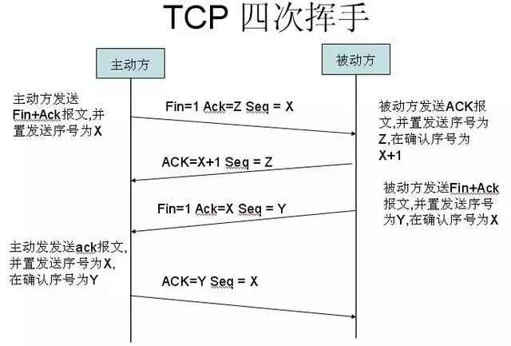
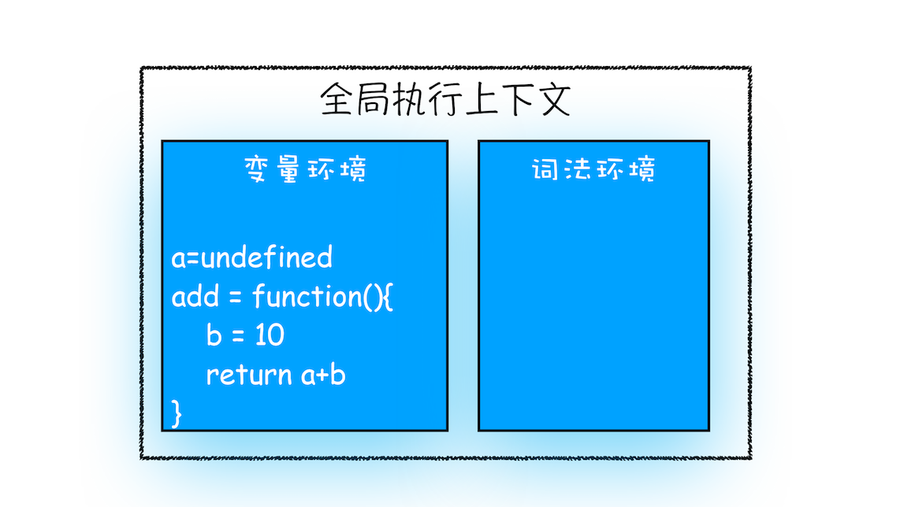
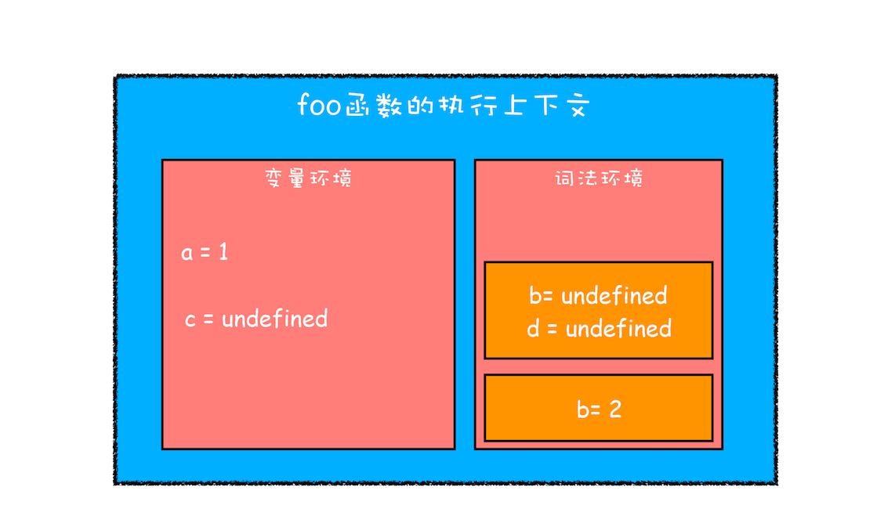
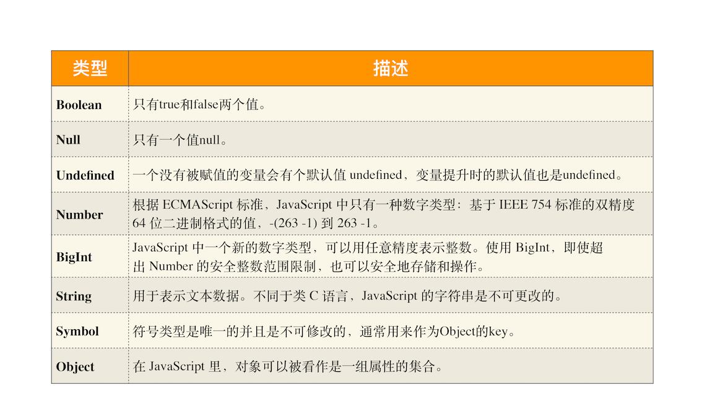
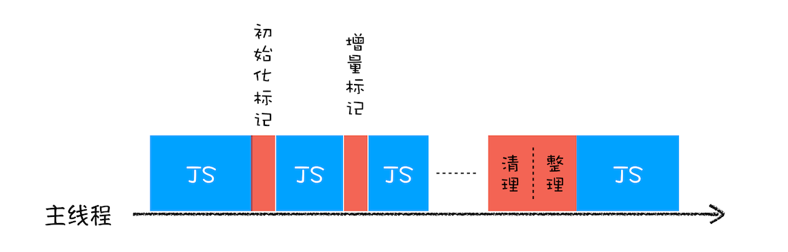

# 浏览器工作原理

## 宏观视角下的浏览器

### 1 chrome 架构

#### 进程和线程

**并行处理：** 计算机中的并行处理就是同一时刻处理多个任务

> 有多个任务要处理时，正常情况下程序可以使用单线程来处理，也就是分步按照顺序分别执行这些任务。如果采用多线程，多个线程同
> 时执行这些任务；使用并行处理能大大提升性能

- 线程不能单独存在，它是由进程进行启动和管理，线程是依附于进程的，而进程中使用多线程并行处理能提升运算效率

- 一个进程就是一个程序的运行实例。启动一个程序的时候，操作系统会为该 程序创建一块内存，用来存放代码、运行中的数据和一个
  执行任务的主线程，我们把这样的 一个运行环境叫进程
- 进程中的任意一线程执行出错，都会导致整个进程的崩溃
- 线程之间共享进程中的数据
- 当一个进程关闭之后，操作系统会回收进程所占用的内存
- 进程之间的内容相互隔离。一个进程挂了不会影响到别的进程，进程与进程之前使用 IPC 进行通信

#### 单进程浏览器时代

> 单进程浏览器是指浏览器的所有功能模块都是运行在同一个进程里，这些模块包含了网络、插件、 JavaScript 运行环境、渲染引擎和
> 页面等。

如此多的功能模块运行在一个进程里，是导致单进程浏览器不稳定、不流畅和不安全的一个主要因素

- **不稳定：** 线程的崩溃导致进程的崩溃，进而整个浏览器崩溃
  - 插件的崩溃导致整个浏览器的崩溃
  - 渲染引擎模块也是不稳定的，一些复杂的 JavaScript 代码就有可能引起渲染引擎模块的崩溃，进而导致浏览器崩溃
- **不流畅：** 所有页面的渲染模块、JavaScript 执行 环境以及插件都是运行在同一个线程中的，这就意味着同一时刻只能有一个模
  块可以执行，js 会阻塞其他模块的进行
- **不安全：** 插件可以使用 C/C++ 等代码编写，通过插件可以获取到操作系统的任意资源，当你在页面 运行一个插件时也就意味着
  这个插件能完全操作你的电脑。如果是个恶意插件，那么它就可 以释放病毒、窃取你的账号密码，引发安全性问题

#### 多进程浏览器时代

##### 早期多进程架构

 <br/>包含渲染进程、插件进程、浏览器主进程，每个 tab
页和一个插件就是一个新的进程

- **不稳定解决方案：** 由于进程是相互隔离的，所以当一个页面或者插件崩溃 时，影响到的仅仅是当前的页面进程或者插件进程，并
  不会影响到浏览器和其他页面，这就 完美地解决了页面或者插件的崩溃会导致整个浏览器崩溃
- **不流畅解决方案：**
  - 同样，JavaScript 也是运行在渲染进程中 的，所以即使 JavaScript 阻塞了渲染进程，影响到的也只是当前的渲染页面，而并不会
    影响浏览器其他页面，因为其他页面的脚本是运行在它们自己的渲染进程中的。
  - 当关闭一个页面时，整个渲染进程也会被关 闭，之后该进程所占用的内存都会被系统回收，这样就轻松解决了浏览器页面的内存 泄
    漏问题。
- **不安全解决方案：** 对插件进程和渲染进程使用**安全沙箱**，可以把沙箱看成是操作系统给进程上了一把锁，沙箱里面的程序可
  以运行， 但是不能在你的硬盘上写入任何数据，也不能在敏感位置读取任何数据，这样即使在渲染进程或者插件进程里 面执行了恶意
  程序，恶意程序也无法突破沙箱去获取系统权限。

##### 目前多进程架构

 <br/>在之前的基础上增加了 GPU 进程和网络进程。

- **浏览器主进程。** 主要负责界面显示、用户交互、子进程管理，同时提供存储等功能。
- **渲染进程。** 核心任务是将 HTML、CSS 和 JavaScript 转换为用户可以与之交互的网页，排版引擎 Blink 和 JavaScript 引擎 V8
  都是运行在该进程中，默认情况下，Chrome 会为每个 Tab 标签创建一个渲染进程。出于安全考虑，渲染进程都是运行在沙箱模式下。
- **GPU 进程。** Chrome 刚开始发布的时候是没有 GPU 进程的。而 GPU 的使用初衷是为了实现 3D CSS 的效果，只是随后网页
  、Chrome 的 UI 界面都选择采用 GPU 来绘制，这使得 GPU 成为浏览器普遍的需求。最后，Chrome 在其多进程架构上也引入了 GPU
  进程。
- **网络进程。** 主要负责页面的网络资源加载，之前是作为一个模块运行在浏览器进程里面的，直至最近才独立出来，成为一个单独
  的进程。负责 http 的请求
- **插件进程。** 主要是负责插件的运行，因插件易崩溃，所以需要通过插件进程来隔离，以保证插件进程崩溃不会对浏览器和页面造
  成影响。

  所以打开一个页面，至少会开启浏览器主进程、渲染进程、GPU 进程、网络进程这四个进程，如果装了插件，那么每个插件都算一个进
  程。

<br/>多进程也有一些弊端：

- **更高的资源占用：** 因为每个进程都会包含公共基础结构的副本（如 JavaScript 运行环境），这就意味着浏览器会消耗更多的内
  存资源。
- **更复杂的体系架构：** 浏览器各模块之间耦合性高、扩展性差等问题，会导致现在的架构已经很难适应新的需求了。

##### 未来面向服务的架构

为了解决这些问题，在 2016 年，Chrome 官方团队使用“面向服务的架构”（Services Oriented Architecture，简称 SOA）的思想设计
了新的 Chrome 架构。也就是说 Chrome 整体架构会朝向现代操作系统所采用的“面向服务的架构” 方向发展，原来的各种模块会被重构
成独立的服务（Service），每个服务（Service）都可以在独立的进程中运行，访问服务（Service）必须使用定义好的接口，通过 IPC
来通信，从而构建一个**更内聚、松耦合、易于维护和扩展的系统**，更好实现 Chrome 简单、稳定、高速、安全的目标。


#### TIPS

- Q:为什么还会碰到一些由于单个页面卡死最终崩溃导致所有页面崩溃的情况？

```
有一种情况，叫"同一站点(same-site)"，具体地讲，我们将“同一站点”定义为根域名（例如，geekbang.org）加上协议（例如，https:// 或者http://），还包含了该根域名下的所有子域名和不同的端口，比如下面这三个：
https://time.geekbang.org
https://www.geekbang.org
https://www.geekbang.org:8080
都是属于同一站点，因为它们的协议都是https，而根域名也都是geekbang.org。

Chrome的默认策略是，每个标签对应一个渲染进程。但是如果从一个页面打开了新页面，而新页面和当前页面属于同一站点时，那么新页面会复用父页面的渲染进程。官方把这个默认策略叫process-per-site-instance。即统一站点的页面共用一个渲染进程。

为什么要让他们跑在一个进程里面呢？
因为在一个渲染进程里面，他们就会共享JS的执行环境，也就是说A页面可以直接在B页面中执行脚本。因为是同一家的站点，所以是有这个需求的。
```

- Q:为什么打开一个页面后没有插件也不只四个进程？

```
如果页面里有iframe的话，iframe也会运行在单独的进程中！
```

- Q:Chrome 排版引擎现在是 blink，这一点从哪里可以看到呢？在 76 版本 Chrome 的 navigator 属性值里只看到了 AppleWebkit，这
  是为什么？

```
UserAgent，又称为UA，UA是浏览器的身份证，通常，在发送HTTP请求时，UA会附带在HTTP的请求头中user-agent字段中，这样服务器就会知道浏览器的基础信息，然后服务器会根据不同的UA返回不同的页面内容，比如手机上返回手机的样式，PC就返回PC的样式。

服务器会根据不同的UA来针性的设计不同页面，所以当出了一款新浏览器时，他如果使用自己独一无二的UA，那么之前的很多服务器还需要针对他来做页面适配，这显然是不可能的，比如Chrome发布时他会在他的UA中使用“Mozilla” ，“AppleWebKit”，等关键字段，用来表示他同时支持Mozilla和AppleWebKit，然后再在最后加上他自己的标示，如Chrome/xxx。

这就解释了为什么查看的信息中含有WebKit字样。
```

- 安全沙箱是不能应用到浏览器主进程之上的，因为浏览器主进程需要对操作系统的权限

### 2 http

浏览器展示页面，离不开 http 协议，而 http 是基于 tcp 的应用层协议，而 tcp 基于 ip

#### IP

数据包要在互联网上进行传输，就要符合网际协议（Internet Protocol，简称 IP）标准。互联网上不同的在线设备都有唯一的地址，地
址只是一个数字，这个地址就是 IP。

**计算机的地址就称为 IP 地址，访问任何网站实际上只是你的计算机向另外一台计算机请求信息**

<p>把一个数据包从主机 A 发送给主机 B，简单的三层网络模型</p>

> IP 头是 IP 数据包开头的信息，包含 IP 版本、源 IP 地址、目标 IP 地址、生存时间等信息。


- 上层将含有“极客时间”的数据包交给网络层；
- 网络层再将 IP 头附加到数据包上，组成新的 IP 数据包，并交给底层；
- 底层通过物理网络将数据包传输给主机 B；
- 数据包被传输到主机 B 的网络层，在这里主机 B 拆开数据包的 IP 头信息，并将拆开来的数据部分交给上层；
- 最终，含有“极客时间”信息的数据包就到达了主机 B 的上层了。

#### UDP

IP 是非常底层的协议，只负责把数据包传送到对方电脑，但是对方电脑并不知道把数据包交给哪个程序，是交给浏览器还是交给英雄联
盟？因此，需要基于 IP 之上开发能和应用打交道的协议，最常见的是“用户数据包协议（User Datagram Protocol）”，简称 UDP。

UDP 中一个最重要的信息是端口号，端口号其实就是一个数字，每个想访问网络的程序都需要绑定一个端口号。

**所以 IP 通过 IP 地址信息把数据包发送给指定的电脑，而 UDP 通过端口号把数据包分发给正确的程序**。和 IP 头一样，端口号会
被装进 UDP 头里面，UDP 头再和原始数据包合并组成新的 UDP 数据包。UDP 头中除了目的端口，还有源端口号等信息。


下面我们一起来看下一个数据包从主机 A 旅行到主机 B 的路线：

- 上层将含有“极客时间”的数据包交给传输层；
- 传输层会在数据包前面附加上 UDP 头，组成新的 UDP 数据包，再将新的 UDP 数据包交给网络层；
- 网络层再将 IP 头附加到数据包上，组成新的 IP 数据包，并交给底层；
- 数据包被传输到主机 B 的网络层，在这里主机 B 拆开 IP 头信息，并将拆开来的数据部分交给传输层；
- 在传输层，数据包中的 UDP 头会被拆开，并根据 UDP 中所提供的端口号，把数据部分交给上层的应用程序；
- 最终，含有“极客时间”信息的数据包就旅行到了主机 B 上层应用程序这里。

#### TCP

UDP 存在以下不足：

- 数据包在传输过程中容易丢失；
- 大文件会被拆分成很多小的数据包来传输，这些小的数据包会经过不同的路由，并在不同的时间到达接收端，而 UDP 协议并不知道如
  何组装这些数据包，从而把这些数据包还原成完整的文件。

基于这两个问题，引入 TCP（Transmission Control Protocol，传输控制协议），它是一种面向连接的、可靠的、基于字节 流的传输层
通信协议。相对于 UDP，TCP 有下面两个特点:

- 对于数据包丢失的情况，TCP 提供重传机制；
- TCP 引入了数据包排序机制，用来保证把乱序的数据包组合成一个完整的文件。

和 UDP 头一样，TCP 头除了包含了目标端口和本机端口号外，还提供了用于排序的序列号，以便接收端通过序号来重排数据包。


一个完整的 TCP 连接的生命周期包括了“建立连接”“传输数据”和“断开连接”三个阶段。

##### TCP 建立连接

三次握手建立连接 

- 第一次握手： 建立连接。客户端发送连接请求报文段，将 SYN 位置为 1，Sequence Number 为 x；然后，客户端进入 SYN_SEND 状态
  ，等待服务器的确认
- 第二次握手：服务器收到 SYN 报文段。服务器收到客户端的 SYN 报文段，需要对这个 SYN 报文段进行确认，设置 Acknowledgment
  Number 为 x+1(Sequence Number+1)；同时，自己还要发送 SYN 请求信息，将 SYN 位置为 1，Sequence Number 为 y；服务器端将上
  述所有信息放到一个报文段（即 SYN+ACK 报文段）中，一并发送给客户端，此时服务器进入 SYN_RECV 状态
- 第三次握手：客户端收到服务器的 SYN+ACK 报文段。然后将 Acknowledgment Number 设置为 y+1，向服务器发送 ACK 报文段，这个
  报文段发送完毕以后，客户端和服务器端都进入 ESTABLISHED 状态，完成 TCP 三次握手。

简单点讲就是：第一次握手：客户端向服务端发送连接请求；第二次握手：服务端确认连接，并向客户端发送连接请求；第三次握手：客
户端确认连接，三次握手成功

_为什么要三次握手？_

<p>为了防止已失效的连接请求报文段突然又传送到了服务端，因而产生错误，所以有第三次客户端确认握手</p>

##### TCP 断开连接



- 第一次挥手： 主机 1（可以使客户端，也可以是服务器端），设置 Sequence Number，向主机 2 发送一个 FIN 报文段；此时，主机
  1 进入 FIN_WAIT_1 状态；这表示主机 1 没有数据要发送给主机 2 了；

- 第二次挥手： 主机 2 收到了主机 1 发送的 FIN 报文段，向主机 1 回一个 ACK 报文段，Acknowledgment Number 为 Sequence
  Number 加 1；主机 1 进入 FIN_WAIT_2 状态；主机 2 告诉主机 1，我“同意”你的关闭请求；

- 第三次挥手： 主机 2 向主机 1 发送 FIN 报文段，请求关闭连接，同时主机 2 进入 LAST_ACK 状态；

- 第四次挥手： 主机 1 收到主机 2 发送的 FIN 报文段，向主机 2 发送 ACK 报文段，然后主机 1 进入 TIME_WAIT 状态；主机 2 收
  到主机 1 的 ACK 报文段以后，就关闭连接；此时，主机 1 等待 2MSL 后依然没有收到回复，则证明 Server 端已正常关闭，那好，
  主机 1 也可以关闭连接了。

简单点讲就是：因为 TCP 是全双工模式，所以断开连接时需要客户端和服务端都要发一次断开连接请求。第一次挥手：客户端发送断开
连接请求；第二次挥手：服务端发送同意断开连接请求给客户端；第三次挥手：服务端发送断开连接请求；第四次挥手：客户端发送同意
断开连接请求给服务端

- _为什么要四次挥手？_

<p>TCP 协议是一种面向连接的、可靠的、基于字节流的运输层通信协议。TCP 是全双工模式，这就意味着，当主机
1 发出 FIN 报文段时，只是表示主机 1 已经没有数据要发送了，主机 1 告诉主机 2，它的数据已经全部发送完毕了；但是，这个时候
主机 1 还是可以接受来自主机 2 的数据；当主机 2 返回 ACK 报文段时，表示它已经知道主机 1 没有数据发送了，但是主机 2 还是可
以发送数据到主机 1 的；当主机 2 也发送了 FIN 报文段时，这个时候就表示主机 2 也没有数据要发送了，就会告诉主机 1，我也没有
数据要发送了，之后彼此就会愉快的中断这次 TCP 连接。</p>

#### HTTP

**HTTP 协议，正是建立在 TCP 连接基础之上的，HTTP 是一种允许浏览器向服务器获取资源的协议，是 Web 的基础**

##### http 报文结构

http 报文分为请求报文和响应报文，它的结构分为：

- 通用头部
- 请求/响应头部
- 请求/响应体

以下对这些报文做详细分析：

1. 通用头部

```json
Request Url: 请求的web服务器地址
// http1.0 定义：get post head
// http1.1 新增五种：options put delete trace connect
Request Method: 请求方式（Get、POST、OPTIONS、PUT、HEAD、DELETE、CONNECT、TRACE）
Status Code: 请求的返回状态码，如200代表成功
Remote Address: 请求的远程服务器地址（会转为IP）
```

1.1 状态码

```
1XX-指示信息，代表请求已经收到，继续处理
2XX-成功，请求已被成功接收、理解、接收
3XX-重定向，
4XX-客户端出错，
5XX-服务器端出错
```

2. 请求头部（部分）

```
Accept: 接收类型，表示浏览器支持的MIME类型
（对标服务端返回的Content-Type）
Accept-Encoding：浏览器支持的压缩类型,如gzip等,超出类型不能接收
Content-Type：客户端发送出去实体内容的类型
Cache-Control: 指定请求和响应遵循的缓存机制，如no-cache
If-Modified-Since：对应服务端的Last-Modified，用来匹配看文件是否变动，只能精确到1s之内，http1.0中
Expires：缓存控制，在这个时间内不会请求，直接使用缓存，http1.0，而且是服务端时间
Max-age：代表资源在本地缓存多少秒，有效时间内不会请求，而是使用缓存，http1.1中
If-None-Match：对应服务端的ETag，用来匹配文件内容是否改变（非常精确），http1.1中
Cookie: 有cookie并且同域访问时会自动带上
Connection: 当浏览器与服务器通信时对于长连接如何进行处理,如keep-alive（重复利用tcp）
Host：请求的服务器URL
Origin：最初的请求是从哪里发起的（只会精确到端口），Origin比Referer更尊重隐私
Referer：该页面的来源URL(适用于所有类型的请求，会精确到详细页面地址，csrf拦截常用到这个字段)
User-Agent：用户客户端的一些必要信息，如UA头部等
```

3. 响应头部(部分)

```
Access-Control-Allow-Headers: 服务器端允许的请求Headers
Access-Control-Allow-Methods: 服务器端允许的请求方法
Access-Control-Allow-Origin: 服务器端允许的请求Origin头部（譬如为*）
Content-Type：服务端返回的实体内容的类型
Date：数据从服务器发送的时间
Cache-Control：告诉浏览器或其他客户，什么环境可以安全的缓存文档
Last-Modified：请求资源的最后修改时间
Expires：应该在什么时候认为文档已经过期,从而不再缓存它
Max-age：客户端的本地资源应该缓存多少秒，开启了Cache-Control后有效
ETag：请求变量的实体标签的当前值
Set-Cookie：设置和页面关联的cookie，服务器通过这个头部把cookie传给客户端
Keep-Alive：如果客户端有keep-alive，服务端也会有响应（如timeout=38）
Server：服务器的一些相关信息
```

4.  请求头部和响应头部对应的字段

    - 请求头：Accept 响应头：Content-Type
    - 请求头：Origin 跨域 响应头：Access-Control-Allow-Origin
    - 请求头：If-Modified-Since 缓存 响应头：Last-Modified
    - 请求头：If-None-Match 缓存 响应头：ETag

5.  CRLF 意思是回车换行，一般作为分隔符存在

##### cookie

因为请求同域名的资源请求时，浏览器会默认带上本地的 cookie，针对这种情况，在某些场景下是需要优化的。 场景：

```
客户端在域名A下有cookie（这个可以是登陆时由服务端写入的）
然后在域名A下有一个页面，页面中有很多依赖的静态资源（都是域名A的，譬如有20个静态资源）
此时就有一个问题，页面加载，请求这些静态资源时，浏览器会默认带上cookie
也就是说，这20个静态资源的http请求，每一个都得带上cookie，而实际上静态资源并不需要cookie验证
此时就造成了较为严重的浪费，而且也降低了访问速度（因为内容更多了）
```

此时可以进行多域名拆分：

- 将静态资源分组，分别放到不同的域名下（如 static.base.com）
- 而 page.base.com（页面所在域名）下请求时，是不会带上 static.base.com 域名的 cookie 的，所以就避免了浪费。拆分成多域名
  时，在移动端会降低请求速度。因为域名整套解析流程是很耗费时间的，而且移动端一般带宽都比不上 pc，此时可以用 dns-prefetch
  进行优化（让浏览器空闲时提前解析 dns 域名，不过也请合理使用，勿滥用）

另外在本地开发时一种常见的利用 cookie 的情况就是借助 cookie 的 domain 属性，客服端和服务端只能设置该域名或者子域名下的
cookie，默认是页面所载域名。例如在`page.base.com`下可以设置`page.base.com`和 `base.com`的`cookie`，不能设
置`static.base.com`域名的`cookie`。而`static.base.com`可以获取`static.base.com base.com`下的`cookie`。所以在本地开发时通
常可以使用`test.page.base.com`的域名通过`hosts`文件修改指向本地，这样`test.page.base.com`可以拿
到`page.base.com base.com`的 `cookie`，获取网站的登录态

##### 长连接和短连接

tcp/ip 层面的定义：

- 长连接：一个 tcp/ip 连接上可以连续发送多个数据包，在 tcp 连接保持期间，如果没有数据包发送，需要双方发检测包以维持此连
  接，一般需要自己做在线维持（类似于心跳包）
- 短连接：通信双方有数据交互时，就建立一个 tcp 连接，数据发送完成后，则断开此 tcp 连接
- http1.0：默认使用的是短连接，也就是说，浏览器每进行一次 http 操作，就建立一次连接，任务结束就中断连接，譬如每一个静态
  资源请求时都是一个单独的连接
- http1.1：默认使用的是长连接。使用长连接会有这一行 Connection: keep-alive，在长连接的情况下，当一个网页打开完成后，客户
  端和服务端之间用于传输 http 的 tcp 连接不会关闭，如果客户端再次访问这个服务器的页面，会继续使用这一条已经建立的连接

有些时候，`TCP` 建立连接和断开连接的时间就有可能`http`超过传输数据的时间了，这种短连接的效率是异常的低效。所以
在`http1.1`出现长连接来优化。但是使用 keep-alive 同样存在问题，比如一个页面可能有 100 张图片素材，假设这些图片素材都保存
在同一个域名下面，如果只复用一个 http 管道的话，那么传输 100 张图片的素材也是非常耗时间的。这就出现了同一时刻并发连接服
务器的需求，所以在 chrome 浏览器对同一域名下面，只能可以发起 6 个请求，这样就可以大大提升请求效率了。

#### http 缓存

http 缓存分为强缓存（200 from cache）和协商缓存(304)

##### 强缓存（200 from cache）

浏览器如果判断本地缓存未过期，就直接使用，无需发起 http 请求。如果已经过期，浏览器向服务器发送 http 请求，如果服务器内容
没有变化会返回 304 告诉浏览器使用缓存，如果文件已更新，返回新内容

- 属于强缓存控制的请求头：
  > http1.1:Cache-Control/Max-Age <br/> http1.0:Pragma（仅有 no-cache 一个可选值，而且它的级别最高）/Expires

##### 协商缓存（304 from cache）

浏览器向服务器发送 http 请求验证是否失效（新鲜），如果没有失效服务端会返回 304，此时客户端直接从缓存中获取所请求的数据，
如果标识失效，服务端会返回更新后的数据。

- 属于协商缓存控制的请求头：
  > http1.1 If-None-Match（比较 ETag 是否不一致）、IF-Match（比较 ETag 是否一致）/E-tag <br/> http1.0
  > If-Modified-Since（比较资源最后更新时间是否一致）、IF-Unmodified-Since（比较资源最后更新时间是否不一致
  > ）/Last-Modified

在 html 页面使用*META HTTP-EQUIV="Pragma" CONTENT="no-cache"*也可以控制缓存，但是对缓存代理服务器不适用

##### 1.0 和 1.1 缓存的区别

- max-age 和 expires

  > **expires** 使用的是服务器时间。但是如果客户端时间和服务端不同步,那么缓存就会出现问题<br/> **max-age** 使用的是绝对
  > 时间由浏览器根据自己的时间+绝对值进行计算

  **如果同时开启了 Cache-Control 与 Expires，Cache-Control 优先级高。如果开启了 Pragma:no-cache，那么 no-cache 层级最
  高**

- E-tag 和 Last-Modified

  > Last-Modified

  - 表明服务端的文件最后何时改变的
  - 它有一个缺陷就是只能精确到 1s
  - 然后还有一个问题就是有的服务端的文件会周期性的改变，导致缓存失效

  > **E-tag**

  - 是一种指纹机制，代表文件相关指纹
  - 只有文件变才会变，也只要文件变就会变
  - 也没有精确时间的限制，只要文件一变，立马 E-tag 就不一样了

  **如果同时带有 E-tag 和 Last-Modified，服务端会优先检查 E-tag**

### 3 从输入 URL 到页面展示


- 用户输入 url，判断是否是地址，是地址的话，组装协议，拼接成完成的 url
- 浏览器进程通过 IPC 发给网络进程，网络进程判断是否有缓存，有缓存就直接发送给浏览器进程，没有缓存则发送请求
- 发送请求前包含 DNS 解析获取 IP 地址，https 建立 tls 连接，建立 TCP 连接，最后发送 http 请求
- 服务器响应 URL 请求之后，浏览器进程就又要开始准备渲染进程了。如果响应了 301 302，那么重定向到响应的 location 字段地址
  ，发起 http 请求，从头开始。
- 渲染进程默认是一个 tab 一个渲染进程。当同一站点时，可能存在多个页面一个进程，但是当页面使用
  了`rel="noopener noreferrer"`，那么同一站点不会共用一个渲染进程，这个属性告诉浏览器，新打开的子窗口不需要访问父窗口的
  任何内容
- 渲染进程准备好之后，需要先向渲染进程提交页面数据，我们称之为提交文档阶段；
- 渲染进程接收完文档信息之后，便开始解析页面和加载子资源，完成页面的渲染。

#### 1 用户输入

当用户在地址栏中输入一个查询关键字时，地址栏会判断输入的关键字是搜索内容，还是请求的 URL：

- 如果是搜索内容，地址栏会使用浏览器默认的搜索引擎，来合成新的带搜索关键字的 URL。
- 如果判断输入内容符合 URL 规则，比如输入的是 time.geekbang.org，那么地址栏会根据规则，把这段内容加上协议，合成为完整的
  URL，如 https://time.geekbang.org。

当浏览器刚开始加载一个地址之后，标签页上的图标便进入了加载状态。但此时图中页面显示的依然是之前打开的页面内容，并没立即替
换为极客时间的页面。因为需要等待提交文档阶段，页面内容才会被替换。

#### 2 URL 请求过程

浏览器进程会通过进程间通信（IPC）把 URL 请求发送至网络进程，网络进程接收到 URL 请求后，会在这里发起真正的 URL 请求流程。

- 首先，网络进程会查找本地缓存是否缓存了该资源。
  - 有缓存资源，那么直接返回资源给浏览器进程
  - 没有缓存，那么直接进入网络请求流程
- 进行 DNS 解析，以获取请求域名的服务器 IP 地址，如果请求协议是 HTTPS，那么还需要建立 TLS 连接。
- 利用 IP 地址和服务器建立 TCP 连接，经历 TCP3 次握手
- 连接建立之后，浏览器端发送 http 请求，会构建请求行、请求头等信息，并把和该域名相关的 Cookie 等数据附加到请求头中，然后
  向服务器发送构建的请求信息。
- 服务器接收到请求信息后，会根据请求信息生成响应数据（包括响应行、响应头和响应体等信息），并发给网络进程。等网络进程接收
  了响应行和响应头之后，就开始解析响应头的内容了。

##### 2.1 重定向

在接收到服务器返回的响应头后，网络进程开始解析响应头，如果发现返回的状态码是 301 或者 302，那么说明服务器需要浏览器重定
向到其他 URL。这时网络进程会从响应头的 Location 字段里面读取重定向的地址，然后再发起新的 HTTP 或者 HTTPS 请求，一切又重
头开始了。

##### 2.2 响应数据处理

浏览器会根据响应头的`Content-Type` 的值来决定如何显示响应体的内容，`Content-Type` 是 `HTTP` 头中一个非常重要的字段， 它
告诉浏览器服务器返回的响应体数据是什么类型。例如：

- Content-type： text/html，告诉浏览器服务器返回的数据是 HTML 格式，可以在页面上渲染
- Content-Type：application/octet-stream，字节流类型，浏览器会按照**下载类型**来处理该请求。

如果服务器配置 Content-Type 不正确，比如将 text/html 类型配置成 application/octet-stream 类型，那么浏览器可能会曲解文件
内容，比如会将一个本来是用来展示的页面，变成了一个下载文件。

##### 2.3 渲染进程

Chrome 的默认策略是，每个标签对应一个渲染进程。但如果从一个页面打开了另一个新页面，而新页面和当前页面属于同一站点的话，
那么新页面会复用父页面的渲染进程。官方把这个默认策略叫 `process-per-site-instance`。若新页面和当前页面不属于同一站点，那
么新页面会使用一个新的渲染进程。

> 同一站点：根域名加上协议相同即是同一站点。<br/> >
> `https://time.static.org https://www.static.org https://www.static.org:8080`这三个为同一站点，他们的协议都是`https`，
> 根域名都是`static.org`,端口号的差异不是判断同一站点的根据。

有个例外，当打开新页面的标签页使用`<a target="_blank" rel="noopener noreferrer" href="xxx" >xxx</a>`包
含`rel="noopener noreferrer"`属性，那么同一站点不会共用一个渲染进程，这个属性告诉浏览器，新打开的子窗口不需要访问父窗口
的任何内容。浏览器在打开新页面时，解析到含有 `noopener noreferrer` 时，就知道他们不需要共享页面内容，所以这时候浏览器就
会让新链接在一个新页面中打开了。

##### 2.4 提交文档

这里的“文档”是指 URL 请求的响应体数据。

- “提交文档”的消息是由浏览器进程发出的，渲染进程接收到“提交文档”的消息后，会和网络进程建立传输数据的“管道”。
- 等文档数据传输完成之后，渲染进程会返回“确认提交”的消息给浏览器进程。
- 浏览器进程在收到“确认提交”的消息后，会更新浏览器界面状态，包括了安全状态、地址栏的 URL、前进后退的历史状态，并更新 Web
  页面。

这也就解释了为什么在浏览器的地址栏里面输入了一个地址后，之前的页面没有立马消失，而是要加载一会儿才会更新页面。

#### 3 渲染流程

接受到响应内容后，渲染进程开启渲染，其中包含：

- 构建 DOM 树，解析 html 标签
- 样式计算，将 css 转换成浏览器可识别的 styleSheets，根据 CSS 的继承规则和层叠规则得到每个 DOM 的具体属性
- 布局阶段，创建布局树，计算好节点位置后再把位置信息重新写回布局树
- 分层，页面一些复杂的动画，需要通过特定的分层来优化渲染
- 绘制，对每个图层进行绘制，对每个图层拆分成小的绘制指令，形成了一个绘制列表
- 分块，渲染进程里的合成线程将图层分为图块
- 光栅化，合成线程按照视口附近的图块来优先生成位图，实际生成位图的操作是由栅格化来执行的。所谓栅格化，是指将图块转换为位
  图。
- 合成，浏览器进程根据 DrawQuad 消息生成页面，并显示到显示器上。

#### 3.1 构建 DOM 树

因为浏览器无法直接理解和使用 HTML，所以需要将 HTML 转换为浏览器能够理解的结构——DOM 树。


#### 3.2 样式计算

样式计算的目的是为了计算出 DOM 节点中每个元素的具体样式，这个阶段大体可分为三步来完成。

1. 把 CSS 转换为浏览器能够理解的结构

和 HTML 文件一样，浏览器也是无法直接理解这些纯文本的 CSS 样式，所以当渲染引擎接收到 CSS 文本时，会执行一个转换操作，将
CSS 文本转换为浏览器可以理解的结构——styleSheets。 而 css 样式来源主要有三种：

- 通过 link 引用的外部 CSS 文件
- `<style>`标记内的 CSS
- 元素的 style 属性内嵌的 CSS

在浏览器控制台中输入 `document.styleSheets`，然后就看到如下图所示的结构：


`document.styleSheets`包含了很多种样式，已经把那三种来源的样式都包含进去了，渲染引擎会把获取到的 CSS 文本全部转换为
`styleSheets` 结构中的数据

2.  转换样式表中的属性值，使其标准化

上一步已经把现有的 CSS 文本转化为浏览器可以理解的结构了，那么**接下来就要对其进行属性值的标准化操作。**

```css
body {
  font-size: 2em;
}
p {
  color: blue;
}
span {
  display: none;
}
div {
  font-weight: bold;
}
div p {
  color: green;
}
div {
  color: red;
}
```

可以看到上面的 CSS 文本中有很多属性值，如 2em、blue、bold，这些类型数值不容易被渲染引擎理解，所以 <strong>需要将所有值转
换为渲染引擎容易理解的、标准化的计算值</strong>， 这个过程就是属性值标准化。


3. 计算出 DOM 树中每个节点的具体样式

根据 CSS 的继承规则和层叠规则，继承于父元素的属性，和多个来源的 css 同时作用于该 dom，计算出每个 DOM 具体样式。

#### 3.3 布局阶段

现在，我们有 DOM 树和 DOM 树中元素的样式，但这还不足以显示页面，因为还不知道 DOM 元素的几何位置信息，接下来就需要计算出
DOM 树中可见元素的几何位置，我们把这个计算过程叫做布局。

Chrome 在布局阶段需要完成两个任务：创建布局树和布局计算。

1. 创建布局树

DOM 树还含有很多不可见的元素，比如 head 标签，还有使用了 display:none 属性的元素。所以在显示之前，我们还要额外
地<strong>构建一棵只包含可见元素布局树。</strong>


为了构建布局树，浏览器大体上完成了下面这些工作：

- 遍历 DOM 树中的所有可见节点，并把这些节点加到布局中；
- 而不可见的节点会被布局树忽略掉，如 head 标签下面的全部内容，再比如 body.p.span 这个元素，因为它的属性包含
  dispaly:none，所以这个元素也没有被包进布局树。

2. 布局计算

现在有了一棵完整的布局树。那么接下来，就要计算布局树节点的坐标位置了。

在执行布局操作的时候，会把布局运算的结 果重新写回布局树中，所以布局树既是输入内容也是输出内容，这是布局阶段一个不合理的
地方，因为在布局阶段并没有清晰地将输 入内容和输出内容区分开来。针对这个问题，Chrome 团队正在重构布局代码，下一代布局系统
叫 `LayoutNG`，试图更清晰地分离输入 和输出，从而让新设计的布局算法更加简单。

#### 3.4 分层

因为页面中有很多复杂的效果，如一些复杂的 3D 变换、页面滚动，或者使用 z-indexing 做 z 轴排序等，为了更加方便地实现这些效
果，<strong>渲染引擎还需要为特定的节点生成专用的图层，并生成一棵对应的图层树（LayerTree） </strong>

浏览器的页面实际上被分成了很多图层，这些图层叠加后合成了最终的页面，布局树和图层树关系示意图。


通常情况下，**并不是布局树的每个节点都包含一个图层，如果一个节点没有对应的层，那么这个节点就从属于父节点的图层**

#### 3.5 绘制

在完成图层树的构建之后，渲染引擎会对图层树中的每个图层进行绘制。渲染引擎实现图层的绘制会把一个图层的绘制拆分成很多小的绘
制指令，然后再把这些指令按照顺序组成一个待绘制列表


#### 3.6 栅格化操作

绘制列表只是用来记录绘制顺序和绘制指令的列表，而实际上当图层的绘制列表准备好之后，主线程会把该绘制列表提交（commit）给合
成线程，即<strong>绘制操作是由渲染引擎中的合成线程来完成的。</strong>

通常一个页面可能很大，但是用户只能看到其中的一部分，我们把用户可以看到的这个部分叫做**视口（viewport）**。在有些情况下，
有的图层可以很大，比如有的页面你使用滚动条要滚动好久才能滚动到底部，但是通过视口，用户只能看到页面的很小一部分，所以在这
种情况下，要绘制出所有图层内容的话，就会产生太大的开销，而且也没有必要。基于这个原因，合成线程会将图层划分为<strong>图块
（tile）</strong> ，这些图块的大小通常是 256x256 或者 512x512，


然后 **合成线程会按照视口附近的图块来优先生成位图，实际生成位图的操作是由栅格化来执行的。** 所谓栅格化，是指将图块转换为
位图。而图块是栅格化执行的最小单位。渲染进程维护了一个栅格化的线程池，所有的图块栅格化都是在线程池内执行的。

通常，<strong>栅格化过程都会使用 GPU 来加速生成，使用 GPU 生成位图的过程叫快速栅格化，或者 GPU 栅格化，生成的位图被保存
在 GPU 内存中。</strong>


#### 3.7 合成

一旦所有图块都被光栅化，合成线程就会生成一个绘制图块的命令——“DrawQuad”，然后将该命令提交给浏览器进程。

浏览器进程里面有一个叫 viz 的组件，用来接收合成线程发过来的 DrawQuad 命令，然后根据 DrawQuad 命令，将其页面内容绘制到内
存中，最后再将内存显示在屏幕上。

到这里，经过这一系列的阶段，编写好的 HTML、CSS、JavaScript 等文件，经过浏览器就会显示出漂亮的页面了。


#### 3.8 TIPS

1. 重排-更改元素几何属性


更新元素几何属性后，浏览器触发重新布局、分层，绘制、分块、栅格化、合成展示一系列操作，<strong>重排需要更新完整的渲染流水
线，所以开销也是最大的。</strong>

2. 重绘-更新元素的绘制属性


如果修改了元素的背景颜色，那么布局阶段将不会被执行，因为并没有引起几何位置的变换，所以就直接进入了绘制阶段，然后执行之后
的一系列子阶段，这个过程就叫重绘。相较于重排操作，**重绘省去了布局和分层阶段，所以执行效率会比重排操作要高一些。**

3. 直接合成阶段

如果你更改一个既不要布局也不要绘制的属性，例如修改`transform`属性，渲染引擎将跳过布局和绘制，只执行后续 的合成操作，我们
把这个过程叫做**合成**


因为修改了`transform`属性，是另外一个图层的事情，后续的影响不会影响到主线程的 CSS 计算、布局，分层等，它不会占用主线程的
资源，所以**相对于重绘和重排，合成能大大提升绘制效率。**

## 浏览器中的 JavaScript 执行机制

### 1 变量提升

<strong>变量提升，是指在 JavaScript 代码执行过程中，JavaScript 引擎把变量的声明部分和函数的声明部分提升到代码开头的“行为
”。变量被提升后，会给变量设置默认值，这个默认值是 undefined。</strong>

```js
showName(); // 函数 showName 被执行
console.log(myname); // undefined
var myname = "极客时间";
function showName() {
  console.log("函数 showName 被执行");
}
```

上面代码执行过程分为两步，第一步是变量提升，第二步是可执行代码：


从图中可以看出，对原来的代码主要做了两处调整：

- 第一处是把声明的部分都提升到了代码开头，如变量 myname 和函数 showName，并给变量设置默认值 undefined；
- 第二处是移除原本声明的变量和函数，如 var myname = '极客时间'的语句，移除了 var 声明，整个移除 showName 的函数声明。

### 2 JS 代码的执行流程

变量提升”意味着变量和函数的声明会在物理层面移动到代码的最前面，正如我们所模拟的那样。但这并不准确，<strong>实际上变量和
函数声明在代码里的位置是不会改变的，而且是在编译阶段被 JavaScript 引擎放入内存中。</strong>一段 JavaScript 代码在执行之
前需要被 JavaScript 引擎编译，编译完成之后，才会进入执行阶段。大致流程你可以参考下图：


1. **编译阶段**

参考上面的代码，将上面的代码分为两部分：

**第一部分：变量提升部分的代码。**

```js
var myname = undefined;
function showName() {
  console.log("函数 showName 被执行");
}
```

**第二部分：可执行的代码。**

```js
showName();
console.log(myname);
myname = "极客时间";
```


<center>JavaScript 执行流程细化图</center>

从上图可以看出，输入一段代码，经过编译后，会生成两部分内容：执行上下文（Execution context）和可执行代码。

**执行上下文是 JavaScript 执行一段代码时的运行环境，包含变量环境和词法环境。** 比如调用一个函数，就会进入这个函数的执行
上下文，确定该函数在执行期间用到的诸如 this、变量、对象以及函数等。执行上下文中变量环境的对象（Viriable Environment）保
存了变量提升的内容，比如上面代码中的变量 myname 和函数 showName，都保存在该对象中。

分析以下代码是如何生成变量环境对象。

```js
showName();
console.log(myname);
var myname = "极客时间";
function showName() {
  console.log("函数 showName 被执行");
}
```

- 第 1 行和第 2 行，由于这两行代码不是声明操作，所以 JavaScript 引擎不会做任何处理；
- 第 3 行，由于这行是经过 var 声明的，因此 JavaScript 引擎将在环境对象中创建一个名为 myname 的属性，并使用 undefined 对
  其初始化；
- 第 4 行，JavaScript 引擎发现了一个通过 function 定义的函数，所以它将函数定义存储到堆 (HEAP）中，并在环境对象中创建一个
  showName 的属性，然后将该属性值指向堆中函数的位置（不了解堆也没关系，JavaScript 的执行堆和执行栈我会在后续文章中介绍）
  。

这样就生成了变量环境对象。接下来 JavaScript 引擎会把声明以外的代码编译为字节码，简单理解成以下：

```js
showName();
console.log(myname);
myname = "极客时间";
```

2. **执行阶段**

JavaScript 引擎开始执行“可执行代码”，按照顺序一行一行地执行。

- 当执行到 showName 函数时，JavaScript 引擎便开始在变量环境对象中查找该函数，由于变量环境对象中存在该函数的引用，所以
  JavaScript 引擎便开始执行该函数，并输出“函数 showName 被执行”结果。
- 接下来打印“myname”信息，JavaScript 引擎继续在变量环境对象中查找该对象，由于变量环境存在 myname 变量，并且其值为
  undefined，所以这时候就输出 undefined。
- 接下来执行第 3 行，把“极客时间”赋给 myname 变量，赋值后变量环境中的 myname 属性值改变为“极客时间”，变量环境如下所示：

```
VariableEnvironment:
     myname -> " 极客时间 ",
     showName ->function : {console.log(myname)
```

以上就是一段代码的编译和执行流程。实际上，编译阶段和执行阶段都是非常复杂的，包括了词法分析、语法解析、代码优化、代码生成
等。

#### TIP：代码中出现相同的变量或者函数怎么办

```js
function showName() {
  console.log("极客邦");
}
showName(); // 极客时间
function showName() {
  console.log("极客时间");
}
showName(); // 极客时间
```

分析以上完整执行流程：

- **首先是编译阶段**。遇到了第一个 showName 函数，会将该函数体存放到变量环境中。接下来是第二个 showName 函数，继续存放至
  变量环境中，但是变量环境中已经存在一个 showName 函数了，此时，第二个 showName 函数会将第一个 showName 函数覆盖掉。这样
  变量环境中就只存在第二个 showName 函数了。
- **接下来是执行阶段**。先执行第一个 showName 函数，但由于是从变量环境中查找 showName 函数，而变量环境中只保存了第二个
  showName 函数，所以最终调用的是第二个函数，打印的内容是“极客时间”。第二次执行 showName 函数也是走同样的流程，所以输出
  的结果也是“极客时间”。综上所述，一段代码如果定义了两个相同名

#### 总结

- JavaScript 代码执行过程中，需要先**做变量提升**，而之所以需要实现变量提升，是因为 JavaScript 代码在执行之前需要
  先<strong>编译</strong>。
- 在编译阶段，变量和函数会被存放到**变量环境**中，变量的默认值会被设置为 undefined；在代码**执行阶段**，JavaScript 引擎
  会从执行上下文（变量环境和词法环境）中去查找自定义的变量和函数。
- 如果在编译阶段，存在两个相同的函数，那么最终存放在变量环境中的是最后定义的那个，这是因为后定义的会覆盖掉之前定义的。

### 3 调用栈

哪些情况下代码才算是“一段”代码，才会在执行之前就进行编译并创建执行上下文。一般说来，有这么三种情况：

- 当 JavaScript 执行全局代码的时候，会编译全局代码并创建全局执行上下文，而且在整个页面的生存周期内，全局执行上下文只有一
  份。
- 当调用一个函数的时候，函数体内的代码会被编译，并创建函数执行上下文，一般情况下，函数执行结束之后，创建的函数执行上下文
  会被销毁。
- 当使用 eval 函数的时候，eval 的代码也会被编译，并创建执行上下文。

JavaScript 中经常会出现在一个函数中调用另外一个函数的情况，**调用栈就是用来管理函数调用关系的一种数据结构。**

下面一段代码：

```js
var a = 2;
function add() {
  var b = 10;
  return a + b;
}
add();
```

在执行到函数 add() 之前，JavaScript 引擎会为上面这段代码创建全局执行上下文，包含了声明的函数和变量，你可以参考下图：



执行上下文准备好之后，便开始执行全局代码，当执行到 add 这儿时，JavaScript 判断这是一个函数调用，那么将执行以下操作：

- 首先，从全局执行上下文中，取出 add 函数代码。
- 其次，对 add 函数的这段代码进行编译，并创建该函数的执行上下文和可执行代码。
- 最后，执行代码，输出结果。


就这样，当执行到 add 函数的时候，我们就有了两个执行上下文了——全局执行上下文和 add 函数的执行上下文。 JavaScript 引擎正是
利用栈的这种结构来管理执行上下文的。在执行上下文创建好后，JavaScript 引擎会将执行上下文压入栈中，<strong>通常把这种用来
管理执行上下文的栈称为执行上下文栈，又称调用栈。</strong>

```js
var a = 2;
function add(b, c) {
  return b + c;
}
function addAll(b, c) {
  var d = 10;
  result = add(b, c);
  return a + result + d;
}
addAll(3, 6);
```

当`addAll`函数里执行到了`add`时，调用栈结果如下


当 add 函数返回时，该函数的执行上下文就会从栈顶弹出，并将 result 的值设置为 add 函数的返回值，也就是 9。此时的调用栈如下
图：


紧接着 addAll 执行最后一个相加操作后并返回，addAll 的执行上下文也会从栈顶部弹出，此时调用栈中就只剩下全局上下文了。最终
如下图所示：


#### 总结

- 每调用一个函数，JavaScript 引擎会为其创建执行上下文，并把该执行上下文压入调用栈，然后 JavaScript 引擎开始执行函数代码
  。
- 如果在一个函数 A 中调用了另外一个函数 B，那么 JavaScript 引擎会为 B 函数创建执行上下文，并将 B 函数的执行上下文压入栈
  顶。
- 当前函数执行完毕后，JavaScript 引擎会将该函数的执行上下文弹出栈。
- 当分配的调用栈空间被占满时，会引发“堆栈溢出”问题。

#### TIP 栈溢出

**调用栈是有大小的**，当入栈的执行上下文超过一定数目，JavaScript 引擎就会报错，我们把这种错误叫做**栈溢出**。

尤其是在写递归代码的时候，如果没有控制好终止条件，就很容易出现栈溢出的情况。

```js
function division(a, b) {
  return division(a, b);
}
console.log(division(1, 2));
```

当执行时，就会抛出栈溢出错误。因为当 JavaScript 引擎开始执行这段代码时，它首先调用函数 division，并创建执行上下文，压入
栈中；然而，**这个函数是递归的，并且没有任何终止条件**，所以它会一直创建新的函数执行上下文，并反复将其压入栈中，但栈是有
容量限制的，超过最大数量后就会出现栈溢出的错误。

```js
function runStack(n) {
  if (n === 0) return 100;
  return runStack(n - 2);
}
runStack(500000);


}
```

解决递归的栈溢出，

- 可以设置**恰当的终止条件**。
- 然而上面的代码即使有终止条件，但是`n`太大时，也会出现栈溢出情况，可以使用`while`循环阻止栈溢出。
- 也可以使用为`尾调用优化`

```js
function test(n) {
  while (true) {
    if (n === 0) {
      return 100;
    } else if (n < 0) {
      return new Error("error");
    }
    n -= 2;
  }
}
runStack(500000);
```

[尾调用优化](http://www.ruanyifeng.com/blog/2015/04/tail-call.html)

### 4 let const 解决变量提升

#### 1 作用域

<strong>作用域是指在程序中定义变量的区域，该位置决定了变量的生命周期。通俗地理解，作用域就是变量与函数的可访问范围，即作
用域控制着变量和函数的可见性和生命周期。</strong>

在 ES6 之前，ES 的作用域只有两种：全局作用域和函数作用域。

- 全局作用域中的对象在代码中的任何地方都能访问，其生命周期伴随着页面的生命周期。
- 函数作用域就是在函数内部定义的变量或者函数，并且定义的变量或者函数只能在函数内部被访问。函数执行结束之后，函数内部定义
  的变量会被销毁。

ES6 之后，开始支持块级作用域。<strong>>块级作用域就是使用一对大括号包裹的一段代码，比如函数、判断语句、循环语句，甚至单
独的一个{}都可以被看作是一个块级作用域。 </strong>

```js
//if 块
if(1){}

//while 块
while(1){}

// 函数块
function foo(){

//for 循环块
for(let i = 0; i<100; i++){}

// 单独一个块
{}
```

如果一种语言支持块级作用域，**那么其代码块内部定义的变量在代码块外部是访问不到的**，并且等该代码块中的代码执行完成之后，
**代码块中定义的变量会被销毁**

#### 2 变量提升所带来的问题

1. 变量容易在不被察觉的情况下被覆盖掉

```js
var myname = "he";
function showName() {
  console.log(myname); // undefined
  if (0) {
    // 虽然是false条件，但是编译阶段变量提示，myname为undefined
    var myname = "she";
  }
  console.log(myname); // undefined
}
showName();
```

执行上面这段代码，打印出来的是 undefined。


2. 本应销毁的变量没有被销毁

```js
function foo() {
  for (var i = 0; i < 7; i++) {}
  console.log(i); // 7
}
foo();
```

在有块级作用域的语言中，for 循环结束之后，i 就已经被销毁了，但是在 JavaScript 代码中，i 的值并未被销毁，所以最后打印出来
的是 7。这同样也是由变量提升而导致的，**在创建执行上下文阶段，变量 i 就已经被提升了**，所以当 for 循环结束之后，变量 i
并没有被销毁。

#### 3 ES6 解决变量提升带来的缺陷

上面介绍了变量提升而带来的一系列问题，为了解决这些问题，**ES6 引入了 let 和 const 关键字**，从而使 JavaScript 也能像其他
语言一样拥有了块级作用域。

```js
function varTest() {
  var x = 1;
  if (true) {
    var x = 2; // 同样的变量!
    console.log(x); // 2
  }
  console.log(x); // 2 由于变量提升，x最后赋值为2
}

function letTest() {
  let x = 1;
  if (true) {
    let x = 2; // 不同的变量
    console.log(x); // 2
  }
  console.log(x); // 1 if代码块里的变量被销毁，x=1
}
```

#### 4 JavaScript 是如何支持块级作用域的

ES 可以通过使用 let 或者 const 关键字来实现块级作用域，但是在同一段代码中，ES6 是如何做到既要支持变量提升的特性，又要支
持块级作用域的呢？

从**执行上下文的角度**来揭开谜底，下面的代码：

```js
function foo() {
  var a = 1;
  let b = 2;
  {
    let b = 3;
    var c = 4;
    let d = 5;
    console.log(a); // 1
    console.log(b); // 3
  }
  console.log(b); // 2
  console.log(c); // 4
  console.log(d); // 报错
}
foo();
```

- **第一步是编译并创建执行上下文**，

  
  <center>刚执行时 foo 函数的执行上下文</center>

  - 函数内部通过 var 声明的变量，在编译阶段全都被存放到变量环境里面了
  - 通过 let 声明的变量，在编译阶段会被存放到词法环境（Lexical Environment）中。
  - 在函数内部的作用域块中，通过 let 声明的变量并没有被存放到词法环境中。

- **第二步继续执行代码**，

  - 当执行到代码块里面时，变量环境中 a 的值已经被设置成了 1
  - 词法环境中 b 的值已经被设置成了 2

  
    <center>执行 foo 函数内部作用域块时的执行上下文</center>

当进入函数的作用域块时，作用域块中通过 let 声明的变量，会被存放在词法环境的一个单独的区域中，这个区域中的变量并不影响 作
用域块外面的变量，比如在作用域外面声明了变量 b，在该作用域块内部也声明了变量 b，当执行到作用域内部时，它们都是独立的 存
在。

其实，在词法环境内部，维护了一个小型栈结构，栈底是函数最外层的变量，进入一个作用域块后，就会把该作用域块内部的变量压到栈
顶；当作用域执行完成之后，该作用域的信息就会从栈顶弹出，这就是词法环境的结构。需要注意下，所讲的<strong>变量是指通过 let
或者 const 声明的变量。</strong>

- **第三步执行函数内部作用域块**

  - 当执行到作用域块中的 console.log(a)这行代码时，就需要在词法环境和变量环境中查找变量 a 的值了
  - 具体查找方式是：<strong>沿着词法环境的栈顶向下查询，如果在词法环境中的某个块中查找到了，就直接返回给 JavaScript 引擎
    ，如果没有查找到，那么继续在变量环境中查找。</strong>

   <center>变量查找过程</center>

  通过上面的分析，<strong>块级作用域就是通过词法环境的栈结构来实现的，而变量提升是通过变量环境来实现，通过这两者的结合
  ，JavaScript 引擎也就同时支持了变量提升和块级作用域了。</strong>

#### 总结

- 由于 JavaScript 的变量提升存在着变量覆盖、变量污染等设计缺陷，所以 ES6 引入了块级作用域关键字来解决这些问题。
- 级作用域就是通过词法环境的栈结构来实现的，而变量提升是通过变量环境来实现，通过这两者的结合，JavaScript 引擎也就同时支
  持了变量提升和块级作用域了。
- 词法环境内部，维护了一个小型栈结构，每进入一个作用域块，就往词法环境栈里压入由 `let const` 声明的变量

```js
// 词法作用域栈里第一层：myname= '极客时间'
let myname = "极客时间";
{
  // 执行到这里时，词法作用域第二层let myname = undefined
  console.log(myname); // 打印时出现暂时性死区，虽然myname在第二层词法作用域为undefined，但是访问时浏览器会被报错
  let myname = "极客邦";
}
```

### 5 作用域链

当代码执行时，会形成调用栈，**调用栈是由执行上下文组成的，而执行上下文包含词法环境、变量环境**，每个执行上下文的变量环境
中，都包含了一个外部引用，用来指向外部的执行上下文，我们把这个外部引用称为 **outer。**

当一段代码使用了一个变量时，JavaScript 引擎首先会在“当前的执行上下文”中查找该变量，比如上面那段代码在查找 myName 变量时
，如果在当前的变量环境中没有查找到，那么 JavaScript 引擎会继续在 outer 所指向的执行上下文中查找。

以下代码执行：

```js
function bar() {
  console.log(myName); // 极客时间
}
function foo() {
  var myName = " 极客邦 ";
  bar();
}
var myName = " 极客时间 ";
foo();
```

执行到`bar`函数时，其内部调用栈如下：

 <center>执行 bar 函数时的调用栈</center>

查看这段代码打印的数据，第一反应是按照调用栈的顺序来查找变量，查找方式如下：

- 先查找栈顶是否存在 myName 变量，但是这里没有，所以接着往下查找 foo 函数中的变量。
- 在 foo 函数中查找到了 myName 变量，这时候就使用 foo 函数中的 myName。

如果按照这种方式来查找变量，那么最终执行 bar 函数打印出来的结果就应该是“极客邦”。但实际情况并非如此，其实打印出来的结果
是“极客时间”。因为`bar`函数执行上下文的`outer`指向的是 全局执行上下文。

 <center>带有外部引用的调用栈示意图</center>

从图中可以看出，bar 函数和 foo 函数的 outer 都是指向全局上下文的，这也就意味着如果在 bar 函数或者 foo 函数中使用了外部变
量，那么 JavaScript 引擎会去全局执行上下文中查找。我们把这个查找的链条就称为**作用域链**。

其实还有个疑问，foo 函数调用的 bar 函数，那为什么 bar 函数的外部引用是全局执行上下文，而不是 foo 函数的执行上下文？这里
就涉及到**词法作用域。**因为在 JavaScript 执行过程中，其**作用域链是由词法作用域决定的**。

#### 1 词法作用域

<strong>词法作用域就是指作用域是由代码中函数声明的位置来决定的，所以词法作用域是静态的作用域，通过它就能够预测代码在执行
过程中如何查找标识符。</strong>

 <center>词法作用域</center>

词法作用域就是根据代码的位置来决定的，其中 main 函数包含了 bar 函数，bar 函数中包含了 foo 函数，因为 JavaScript 作用域链
是由词法作用域决定的，所以整个词法作用域链的顺序是：foo 函数作用域—>bar 函数作用域—>main 函数作用域—> 全局作用域。

所以在上面的代码中打印出来的是“极客时间”，因为根据词法作用域，`foo` 和 `bar` 的上级作用域都是全局作用域，所以如果 foo 或
者 bar 函数使用了一个它们没有定义的变量，那么它们会到全局作用域去查找。也就是说，<strong>词法作用域是代码阶段就决定好的
，和函数是怎么调用的没有关系。</strong>

#### 2 块级作用域中的变量查找

上面通过全局作用域和函数级作用域来分析了作用域链，接下来分析块级作用域中变量是如何查找的

```js
function bar() {
  var myName = " 极客世界 ";
  let test1 = 100;
  if (1) {
    let myName = "Chrome 浏览器 ";
    console.log(test); // 1 根据词法作用域判断作用域链，test在bar上下文中没有，那么就从全局上下文查找，找到了test=1
  }
}
function foo() {
  var myName = " 极客邦 ";
  let test = 2;
  {
    let test = 3;
    bar();
  }
}
var myName = " 极客时间 ";
let myAge = 10;
let test = 1;
foo();
```

在之前说过，ES6 是支持块级作用域的，当执行到代码块时，如果代码块中有 let 或者 const 声明的变量，那么变量就会存放到该函数
的词法环境中。上面这段代码，当执行到 bar 函数内部的 if 语句块时，其调用栈的情况如下图所示：

 <center>块级作用域中是如何查找变量的</center>

现在是执行到 bar 函数的 if 语块之内，需要打印出来变量 test，那么就需要查找到 test 变量的值，其查找过程我已经在上图中使用
序号 1、2、3、4、5 标记出来了。先从当前上下文查找词法环境=》变量环境，没有的话到上一个上下文重复查找过程。

#### 3 闭包

<strong>在 JavaScript 中，根据词法作用域的规则，内部函数总是可以访问其外部函数中声明的变量，当通过调用一个外部函数返回一
个内部函数后，即使该外部函数已经执行结束了，但是内部函数引用外部函数的变量依然保存在内存中，我们就把这些变量的集合称为闭
包。</strong>

```js
function foo() {
  var myName = " 极客时间 ";
  let test1 = 1;
  const test2 = 2;
  var innerBar = {
    setName: function (newName) {
      myName = newName;
    },
    getName: function () {
      console.log(test1);
      return myName;
    }
  };
  return innerBar;
}
var bar = foo();
bar.setName(" 极客邦 ");
bar.getName();
console.log(bar.getName());
```

上面代码执行到 foo 函数内部的 return innerBar 时，其调用栈的情况如下：

 <center>执行到 return bar 时候的调用栈（图中有点问
题，innerBar 是一个对象而不是一个函数）</center>

从上面的代码可以看出，innerBar 是一个对象，包含了 getName 和 setName 的两个方法。<strong>根据词法作用域的规则，内部函数
getName 和 setName 总是可以访问它们的外部函数 foo 中的变量</strong>，所以当 innerBar 对象返回给全局变量 bar 时，虽然 foo
函数已经执行结束，但是 getName 和 setName 函数依然可以使用 foo 函数中的变量 myName 和 test1。所以当 foo 函数执行完成之后
，其整个调用栈的状态如下图所示：

 <center>闭包的产生过程</center>

foo 函数执行完成之后，其执行上下文从栈顶弹出了，但是由于返回的 setName 和 getName 方法中使用了 foo 函数内部的变量 myName
和 test1，所以这两个变量依然保存在内存中。

当执行到 bar.setName 方法中的 myName = "极客邦"这句代码时，JavaScript 引擎会沿着“当前执行上下文–>foo 函数闭包–> 全局执行
上下文”的顺序来查找 myName 变量，你可以参考下面的调用栈状态图：

 <center>执行 bar 时调用栈状态</center>

setName 的执行上下文中没有 myName 变量，foo 函数的闭包中包含了变量 myName，所以调用 setName 时，会修改 foo 闭包中的
myName 变量的值。同样的流程，当调用 bar.getName 的时候，所访问的变量 myName 也是位于 foo 函数闭包中的。

**闭包是怎么回收的**

如果闭包使用不正确，会很容易造成内存泄漏的，了解闭包如何回收可以正确的使用闭包。

通常，如果引用闭包的函数是一个全局变量，那么闭包会一直存在直到页面关闭；但如果这个闭包以后不再使用的话，就会造成内存泄漏
。

如果引用闭包的函数是个局部变量，等函数销毁后，在下次 JavaScript 引擎执行垃圾回收时，判断闭包这块内容如果已经不再被使用了
，那么 JavaScript 引擎的垃圾回收器就会回收这块内存。

所以在使用闭包的时候，要尽量注意一个原则：<strong>如果该闭包会一直使用，那么它可以作为全局变量而存在；但如果使用频率不高
，而且占用内存又比较大的话，那就尽量让它成为一个局部变量。</strong>

#### 总结

- 作用域查找变量的链条称为作用域链；作用域链是通过词法作用域来确定的，而词法作用域是由代码中函数声明的位置来决定的，和函
  数是怎么调用的没有关系。。
- 块级作用域中是如何通过作用域链来查找变量的，根据作用域链从词法环境到变量环境查找变量
- 基于作用域链和词法环境介绍了到底什么是闭包。

### 6 this

所以**在对象内部的方法中使用对象内部的属性是一个非常普遍的需求**。但是 JavaScript 的作用域机制并不支持这一点，基于这个需
求，JavaScript 又搞出来另外一套 this 机制。

执行上下文的组成部分，包含变量环境，词法环境，outer，this：

 <center>执行上下文中的 this</center>

**this 是和执行上下文绑定的**，也就是说每个执行上下文中都有一个 this。执行上下文主要分为三种——全局执行上下文、函数执行上
下文和 eval 执行上下文，由于 eval 使用的不多，在此介绍**全局执行上下文中的 this** 和**函数执行上下文中的 this。**

#### 1 全局执行上下文中的 this

局执行上下文中的 this 是指向 window 对象的。

#### 2 函数执行上下文中的 this

```js
function foo() {
  console.log(this);
}
foo();
```

在 foo 函数内部打印出来 this 值，执行这段代码，打印出来的也是 window 对象，这说明在默认情况下调用一个函数，其执行上下文
中的 this 也是指向 window 对象的。但是，有下面三种方式来设置函数执行上下文中的 this 值。

1. **通过函数的 call 方法设置**

```js
let bar = {
  myName: " 极客邦 ",
  test1: 1
};
function foo() {
  this.myName = " 极客时间 ";
}
foo.call(bar);
console.log(bar); // {myName: " 极客时间 ",test1: 1}
console.log(myName); // Uncaught ReferenceError: myName is not defined
```

foo 函数内部的 this 已经指向了 bar 对象，因为通过打印 bar 对象，可以看出 bar 的 myName 属性已经由“极客邦”变为“极客时间”
了，同时在全局执行上下文中打印 myName，JavaScript 引擎提示该变量未定义。

其实除了 **call** 方法，你还可以使用 **bind** 和 **apply** 方法来设置函数执行上下文中的 this，只是使用方式不同，目的都是
一样的。

2. **通过对象调用方法设置**

要改变函数执行上下文中的 this 指向，除了通过函数的 call 方法来实现外，还可以通过对象调用的方式，

```js
var myObj = {
  name: " 极客时间 ",
  showThis: function () {
    console.log(this);
  }
};
myObj.showThis(); // 输出myObj
```

通过 myObj 对象来调用 showThis 方法，输出的 this 值是指向 myObj 的。

**使用对象来调用其内部的一个方法，该方法的 this 是指向对象本身的。**

接下来改变下调用方式，把 **showThis** 赋给一个全局对象，然后再调用该对象，代码如下所示：

```js
var myObj = {
  name: " 极客时间 ",
  showThis: function () {
    this.name = " 极客邦 ";
    console.log(this);
  }
};
var foo = myObj.showThis;
foo(); // 这时打印出来的
```

执行这段代码，this 又指向了全局 window 对象。所以得出了两个结论：

- 在全局环境中调用一个函数，函数内部的 this 指向的是全局变量 window。
- 通过一个对象来调用其内部的一个方法，该方法的执行上下文中的 this 指向对象本身。

3. **通过构造函数中设置**

```js
function CreateObj() {
  this.name = " 极客时间 ";
}
var myObj = new CreateObj();
```

在这段代码中，使用 `new` 创建了对象 `myObj，在` `new` 的过程中，JavaScript 引擎做了如下四件事：

- 首先创建了一个空对象 tempObj；
- 接着调用 CreateObj.call 方法，并将 tempObj 作为 call 方法的参数，这样当 CreateObj 的执行上下文创建时，它的 this 就指向
  了 tempObj 对象；
- 然后执行 CreateObj 函数，此时的 CreateObj 函数执行上下文中的 this 指向了 tempObj 对象；
- 最后返回 tempObj 对象。

#### 3 this 的设计缺陷以及应对方案

1. 嵌套函数中的 this 不会从外层函数中继承

```js
var myObj = {
  name: " 极客时间 ",
  showThis: function () {
    console.log(this);
    function bar() {
      console.log(this);
    }
    bar();
  }
};
myObj.showThis();
```

执行以上代码，会发现函数 bar 中的 this 指向的是全局 window 对象，而函数 showThis 中的 this 指向的是 myObj 对象。即 bar
的 this 没有继承外层函数。

当然，想让 bar 的 this 正确指向，可以用两种方法解决：

```js
r myObj = {
  name : " 极客时间 ",
  showThis: function(){
    console.log(this)
    // 1 通过变量保存this
    var self = this
    function bar(){
      self.name = " 极客邦 "
    }
    // 2 通过箭头函数
    const bar = ()=>{this.name = " 极客邦 "}
    bar()
  }
}
myObj.showThis()
console.log(myObj.name)
console.log(window.name)
```

- 第一种是把 this 保存为一个 self 变量，再利用变量的作用域机制传递给嵌套函数。

- 第二种是继续使用 this，但是要把嵌套函数改为箭头函数，因为箭头函数没有自己的执行上下文，所以它会继承调用函数中的 this。

2. 普通函数中的 this 默认指向全局对象 window

默认情况下调用一个函数，其执行上下文中的 this 是默认指向全局对象 window 的。

不过这个设计也是一种缺陷，因为在实际工作中，我们并不希望函数执行上下文中的 this 默认指向全局对象，因为这样会打破数据的边
界，造成一些误操作。如果要让函数执行上下文中的 this 指向某个对象，最好的方式是通过 call 方法来显示调用。

这个问题可以通过设置 JavaScript 的“严格模式”来解决。<strong>在严格模式下，默认执行一个函数，其函数的执行上下文中的 this
值是 undefined</strong>

#### 总结

- 当函数作为对象的方法调用时，函数中的 this 就是该对象，可以通过 call、apply、bind 修改 this 指向；
- 当函数被正常调用时，在严格模式下，this 值是 undefined，非严格模式下 this 指向的是全局对象 window；
- 嵌套函数中的 this 不会继承外层函数的 this 值。

### 7 js 执行机制总结

- 变量提升：js 先编译在执行，编译过程对声明的变量做变量提升，编译过程中形成执行上下文和可执行代码。

  - 执行上下文包含全局执行上下文、函数执行上下文和 eval 执行上下文
  - 执行上下文包含变量环境（var 声明的变量，函数声明等）、词法环境（let、const 声明的变量）、this 、outer（指向外部的执
    行上下文）。
  - 执行代码过程中会形成执行上下文的调用栈。
  - 变量提升带来了两个主要问题：变量被覆盖（if 语句里的变量覆盖了 if 外的变量）、本应被销毁的变量没有被销毁（例如 for 循
    环中的索引变量）

- 使用 let、const 解决变量提升代码的缺陷：这里使用到了执行上下文中的词法环境。

  - ES6 之前只有全局作用域和函数作用域，引入 let 和 const 后增加了块级作用域。而块级作用域就是通过执行上下文中的词法环境
    实现的。
  - 通过词法环境和变量环境实现了变量提升和块级作用域共存的状态

- 作用域链：执行代码过程中，在执行上下文栈中查找变量的这个链条叫做作用域链，而作用域链是由词法作用域决定的。
  - 词法作用域就是指作用域是由代码中函数声明的位置来决定的，所以词法作用域是静态的作用域，通过它就能够预测代码在执行 过
    程中如何查找标识符。
    ```js
    // bar函数中的myname变量是从全局执行上下文中查找的，而不是foo执行上下文。
    //因为bar声明在全局上下文中，此时它的outer指向外部的执行上下文是全局上下文，这是由词法环境决定的，即函数声明的位置
    function bar() {
      console.log(myName); // 极客时间
    }
    function foo() {
      var myName = " 极客邦 ";
      bar();
    }
    var myName = " 极客时间 ";
    foo();
    ```
- this:根据三种上下文分析 this 指向
  - 全局上下文指向 window
  - 函数上下文默认指向 window
  - 通过对象调用改变 this 指向，构造函数中的 this 指向实例对象
  - 通过`call、apply、bind`改变 this 指向

## 3 V8-工作原理

### 1 栈空间和堆空间

#### 语言类型

**静态语言 vs 动态语言**

静态语言：使用变量之前就需要确认其变量数据类型

动态语言： 在运行过程中需要检查数据类型的语言称为动态语言，即使用变量前不需要确认变量的数据类型

**弱类型语言 vs 强类型语言**

弱类型语言：支持隐式类型转换的语言称为弱类型语言，即弱类型可以其他类型数据赋予给一个声明好的变量，比如把 bool 类型的值赋
值给 string 类型的变量

动态语言： 不支持隐式类型转换的语言称为强类型语言，强类型语言则不能把其他类型的数据赋值给一个声明好的变量

 <center>语言类型图</center>

而 JavaScript 是一种弱类型的、动态的语言

- **弱类型** 意味着你不需要告诉 JavaScript 引擎这个或那个变量是什么数据类型，JavaScript 引擎在运行代码的时候自己会计算出
  来。
- **动态** 意味着你可以使用同一个变量保存不同类型的数据。

在 JavaScript 中，如果你想要查看一个变量到底是什么类型，可以使用“typeof”运算符。具体使用方式如下所示：

```js
var bar;
console.log(typeof bar); //undefined
bar = 12;
console.log(typeof bar); //number
bar = " 极客时间 ";
console.log(typeof bar); //string
bar = true;
console.log(typeof bar); //boolean
bar = null;
console.log(typeof bar); //object
bar = {name: " 极客时间 "};
console.log(typeof bar); //object
```

其实 JavaScript 中的数据类型一种有 8 种，它们分别是：

 <center>数据类型</center>

上面的数据类型有三点要注意：

1. 使用 typeof 检测 Null 类型时，返回的是 Object。这是当初 JavaScript 语言的一个 Bug，一直保留至今，之所以一直没修改过来
   ，主要是为了兼容老的代码。
2. Object 类型比较特殊，它是由上述 7 种类型组成的一个包含了 key-value 对的数据类型。
3. 把前面的 7 种数据类型称为原始类型，把最后一个对象类型称为引用类型，之所以把它们区分为两种不同的类型，是因为它们在内存
   中存放的位置不一样

#### 内存空间

要理解 JavaScript 在运行过程中数据是如何存储的，你就得先搞清楚其存储空间的种类。

 <center>JavaScript 内存模型</center>

从图中可以看出， 在 JavaScript 的执行过程中， 主要有三种类型内存空间，分别是**代码空间**、**栈空间**和**堆空间**。

其中的代码空间主要是存储可执行代码的，这个后续再做介绍。本次主要介绍栈空间和堆空间。

#### 栈空间和堆空间

栈空间就是之前反复提及的调用栈，是用来存储执行上下文的。看下面这段代码：

```js
function foo() {
  var a = " 极客时间 ";
  var b = a;
  var c = {name: " 极客时间 "};
  var d = c;
}
foo();
```

之前说过，当执行一段代码时，需要先编译，并创建执行上下文，然后再按照顺序执行代码。那么下面我们来看看，当执行到第 3 行代
码时，其调用栈的状态：

 <center>执行到第 3 行时的调用栈状态图</center>

当执行到第 3 行时，变量 a 和变量 b 的值都被保存在执行上下文中，而执行上下文又被压入到栈中，所以你也可以认为变量 a 和变量
b 的值都是存放在栈中的。

接下来继续执行第 4 行代码，由于 JavaScript 引擎判断右边的值是一个引用类型，这时候处理的情况就不一样了，JavaScript 引擎并
不是直接将该对象存放到变量环境中，而是将它分配到堆空间里面，分配后该对象会有一个在“堆”中的地址，然后再将该数据的地址写进
c 的变量值，最终分配好内存的示意图如下所示：

 <center>对象类型是“堆”来存储</center>

从上图你可以清晰地观察到，对象类型是存放在堆空间的，在栈空间中只是保留了对象的引用地址，当 JavaScript 需要访问该数据的时
候，是通过栈中的引用地址来访问的，相当于多了一道转手流程。

**原始类型的数据值都是直接保存在“栈”中的，引用类型的值是存放在“堆”中的。** 为什么一定要分“堆”和“栈”两个存储空间呢？所有
数据直接存放在“栈”中不就可以了吗？

答案是不可以的。<strong>这是因为 JavaScript 引擎需要用栈来维护程序执行期间上下文的状态，如果栈空间大了话，所有的数据都存
放在栈空间里面，那么会影响到上下文切换的效率，进而又影响到整个程序的执行效率。</strong>比如文中的 foo 函数执行结束了
，JavaScript 引擎需要离开当前的执行上下文，只需要将指针下移到上个执行上下文的地址就可以了，foo 函数执行上下文栈区空间全
部回收，具体过程你可以参考下图：

 <center>调用栈中切换执行上下文状态</center>

所以**通常情况下，栈空间都不会设置太大，主要用来存放一些原始类型的小数据**。而引用类型的数据占用的空间都比较大，所以这一
类数据会被存放到堆中，**堆空间很大，能存放很多大的数据**，不过缺点是分配内存和回收内存都会占用一定的时间。

那最后一步将变量 c 赋值给变量 d 是怎么执行的？在 JavaScript 中，赋值操作和其他语言有很大的不同，<strong>原始类型的赋值会
完整复制变量值，而引用类型的赋值是复制引用地址。</strong>

所以 d=c 的操作就是把 c 的引用地址赋值给 d，你可以参考下图

 <center>引用赋值</center>

从图中可以看到，变量 c 和变量 d 都指向了同一个堆中的对象，所以这就很好地解释了文章开头的那个问题，通过 c 修改 name 的值
，变量 d 的值也跟着改变，归根结底它们是同一个对象。

#### 再谈缓存

```js
function foo() {
  var myName = " 极客时间 ";
  let test1 = 1;
  const test2 = 2;
  var innerBar = {
    setName: function (newName) {
      myName = newName;
    },
    getName: function () {
      console.log(test1);
      return myName;
    }
  };
  return innerBar;
}
var bar = foo();
bar.setName(" 极客邦 ");
bar.getName();
console.log(bar.getName());
```

当 foo 函数的执行上下文销毁时，由于 foo 函数产生了闭包，所以变量 myName 和 test1 并没有被销毁，而是保存在内存中，那么应
该如何解释这个现象呢？

要解释这个现象，我们就得站在内存模型的角度来分析这段代码的执行流程。

1. 当 JavaScript 引擎执行到 foo 函数时，首先会编译，并创建一个空执行上下文。
2. 在编译过程中，遇到内部函数 setName，JavaScript 引擎还要对内部函数做一次快速的词法扫描，发现该内部函数引用了 foo 函数
   中的 myName 变量，由于是内部函数引用了外部函数的变量，所以 JavaScript 引擎判断这是一个闭包，于是在堆空间创建换一个
   “closure(foo)”的对象（这是一个内部对象，JavaScript 是无法访问的），用来保存 myName 变量。
3. 接着继续扫描到 getName 方法时，发现该函数内部还引用变量 test1，于是 JavaScript 引擎又将 test1 添加到“closure(foo)”对
   象中。这时候堆中的“closure(foo)”对象中就包含了 myName 和 test1 两个变量了。
4. 由于 test2 并没有被内部函数引用，所以 test2 依然保存在调用栈中。

通过上面的分析，我们可以画出执行到 foo 函数中“return innerBar”语句时的调用栈状态，如下图所示：

 <center>闭包的产生过程</center>

从上图你可以清晰地看出，当执行到 foo 函数时，闭包就产生了；当 foo 函数执行结束之后，返回的 getName 和 setName 方法都引用
“clourse(foo)”对象，所以即使 foo 函数退出了，“clourse(foo)”依然被其内部的 getName 和 setName 方法引用。所以在下次调用
bar.setName 或者 bar.getName 时，创建的执行上下文中就包含了“clourse(foo)”。

总的来说，产生闭包的核心有两步：**第一步是需要预扫描内部函数；第二步是把内部函数引用的外部变量保存到堆中。**

#### 总结

1. JavaScript 中的 8 种数据类型，它们可以分为两大类——**原始类型和引用类型。**
2. **原始类型的数据是存放在栈中，引用类型的数据是存放在堆中的。** 堆中的数据是通过引用和变量关联起来的。也就是说
   ，JavaScript 的变量是没有数据类型的，值才有数据类型，变量可以随时持有任何类型的数据。
3. 从内存模型分析闭包的产生过程

### 2 垃圾回收

**原始数据类型是存储在栈空间中的，引用类型的数据是存储在堆空间中的**。不过有些数据被使用之后，可能就不再需要了，我们把这
种数据称为**垃圾数据**。如果这些垃圾数据一直保存在内存中，那么内存会越用越多，所以我们<strong>需要对这些垃圾数据进行回收
，以释放有限的内存空间。</strong>

#### 不同语言的垃圾回收策略

垃圾数据回收分为手动回收和自动回收两种策略。

- C/C++ 就是使用手动回收策略，**何时分配内存、何时销毁内存都是由代码控制的**
- JavaScript、Java、Python 等语言使用的是自动垃圾回收的策略，产生的垃圾数据是由垃圾回收器来释放的, 并不需要手动通过代码
  来释放。

#### 调用栈中的数据是如何回收的

```js
function foo() {
  var a = 1;
  var b = {name: " 极客邦 "};
  function showName() {
    var c = " 极客时间 ";
    var d = {name: " 极客时间 "};
  }
  showName();
}
foo();
```

 <center>执行到 showName 函数时的内存模型</center>

如果执行到 showName 函数时，那么 JavaScript 引擎会创建 showName 函数的执行上下文，并将 showName 函数的执行上下文压入到调
用栈中，最终执行到 showName 函数时，其调用栈就如上图所示。此同时，还有一个**ESP:记录当前执行状态的指针**，指向调用栈中
showName 函数的执行上下文，表示当前正在执行 showName 函数。

当 showName 函数执行完成之后，函数执行流程就进入了 foo 函数，那这时就需要销毁 showName 函数的执行上下文了。JavaScript 会
将 ESP 下移到 foo 函数的执行上下文，**这个下移操作就是销毁 showName 函数执行上下文的过程**。

**JavaScript 引擎会通过向下移动 ESP 来销毁该函数保存在栈中的执行上下文**。

#### 堆中的数据是如何回收的

上面那段代码的 foo 函数执行结束之后，ESP 应该是指向全局执行上下文的，那这样的话，showName 函数和 foo 函数的执行上下文就
处于无效状态了，不过保存在堆中的两个对象依然占用着空间，如下图所示：

 <center>foo 函数执行结束后的内存状态</center>

从图中可以看出，1003 和 1050 这两块内存依然被占用。**要回收堆中的垃圾数据，就需要用到 JavaScript 中的垃圾回收器了**。

#### 代际假说和分代收集

**代际假说**有以下两个特点：

- 第一个是大部分对象在内存中存在的时间很短，简单来说，就是很多对象一经分配内存，很快就变得不可访问；
- 第二个是不死的对象，会活得更久。

其实这两个特点不仅仅适用于 JavaScript，同样适用于大多数的动态语言，如 Java、Python 等。

**分代收集**：在 V8 中会把堆分为**新生代**和**老生代**两个区域，<strong>新生代中存放的是生存时间短的对象，老生代中存放的
生存时间久的对象。</strong>

新生区通常只支持 1 ～ 8M 的容量，而老生区支持的容量就大很多了。对于这两块区域，V8 分别使用两个不同的垃圾回收器，以便更高
效地实施垃圾回收。

- **副垃圾回收器，主要负责新生代的垃圾回收**。
- **主垃圾回收器，主要负责老生代的垃圾回收**。

#### 垃圾回收器的工作流程

V8 把堆分成两个区域——新生代和老生代，并分别使用两个不同的垃圾回收器。其实<strong>不论什么类型的垃圾回收器，它们都有一套
共同的执行流程。</strong>

- 第一步是标记空间中活动对象和非活动对象。所谓活动对象就是还在使用的对象，非活动对象就是可以进行垃圾回收的对象。
- 第二步是回收非活动对象所占据的内存。其实就是在所有的标记完成之后，统一清理内存中所有被标记为可回收的对象。
- 第三步是做内存整理。一般来说，频繁回收对象后，内存中就会存在大量不连续空间，我们把这些不连续的内存空间称为内存碎片。当
  内存中出现了大量的内存碎片之后，如果需要分配较大连续内存的时候，就有可能出现内存不足的情况。所以最后一步需要整理这些内
  存碎片，但这步其实是可选的，因为有的垃圾回收器不会产生内存碎片，比如接下来我们要介绍的副垃圾回收器。

#### 副垃圾回收器

副垃圾回收器主要负责新生区的垃圾回收。而通常情况下，大多数小的对象都会被分配到新生区，所以说这个区域虽然不大，但是垃圾回
收还是比较频繁的。

新生代中用 Scavenge 算法来处理。所谓 Scavenge 算法，是把新生代空间对半划分为两个区域，一半是对象区域，一半是空闲区域，如
下图所示：

 <center>新生区要划分为对象区域和空闲区域</center>

新加入的对象都会存放到对象区域，当对象区域快被写满时，就需要执行一次垃圾清理操作。

在垃圾回收过程中，首先要对对象区域中的垃圾做标记；标记完成之后，就进入垃圾清理阶段，副垃圾回收器会把这些存活的对象复制到
空闲区域中，同时它还会把这些对象有序地排列起来，所以这个复制过程，也就相当于完成了内存整理操作，复制后空闲区域就没有内存
碎片了。

完成复制后，对象区域与空闲区域进行角色翻转，也就是原来的对象区域变成空闲区域，原来的空闲区域变成了对象区域。这样就完成了
垃圾对象的回收操作，同时**这种角色翻转的操作还能让新生代中的这两块区域无限重复使用下去**。

由于新生代中采用的 Scavenge 算法，所以每次执行清理操作时，都需要将存活的对象从对象区域复制到空闲区域。但复制操作需要时间
成本，如果新生区空间设置得太大了，那么每次清理的时间就会过久，所以**为了执行效率，一般新生区的空间会被设置得比较小**。

也正是因为新生区的空间不大，所以很容易被存活的对象装满整个区域。为了解决这个问题，JS 引擎采用了**对象晋升策略**，也就是
**经过两次垃圾回收依然还存活的对象，会被移动到老生区中**。

#### 主垃圾回收器

主垃圾回收器主要负责老生区中的垃圾回收。除了新生区中晋升的对象，**一些大的对象会直接被分配到老生区**。因此老生区中的对象
有两个特点，一个是**对象占用空间大**，另一个是**对象存活时间长**。

由于老生区的对象比较大，若要在老生区中使用 Scavenge 算法进行垃圾回收，复制这些大的对象将会花费比较多的时间，从而导致回收
执行效率不高，同时还会浪费一半的空间。因而，主垃圾回收器是采用**标记 - 清除（Mark-Sweep）**的算法进行垃圾回收的。

- 首先是标记过程阶段。标记阶段就是从一组根元素开始，递归遍历这组根元素，在这个遍历过程中，**能到达的元素称为活动对象**，
  没有到达的元素就可以判断为**垃圾数据**。
- 接下来就是垃圾的清除过程。它和副垃圾回收器的垃圾清除过程完全不同，你可以理解这个过程是清除掉红色标记数据的过程，可参考
  下图大致理解下其清除过程：

   <center>标记清除过程</center>

上面的标记过程和清除过程就是标记 - 清除算法，不过对一块内存多次执行标记 - 清除算法后，会产生大量不连续的内存碎片。而碎片
过多会导致大对象无法分配到足够的连续内存，于是又产生了另外一种算法——**标记 - 整理（Mark-Compact）**，这个标记过程仍然与
标记 - 清除算法里的是一样的，但后续步骤不是直接对可回收对象进行清理，而是让所有存活的对象都向一端移动，然后直接清理掉端
边界以外的内存

 <center>标记整理</center>

#### 全停顿

V8 是使用副垃圾回收器和主垃圾回收器处理垃圾回收的，不过由于 JavaScript 是运行在主线程之上的，一旦执行垃圾回收算法，都需
要将正在执行的 JavaScript 脚本暂停下来，待垃圾回收完毕后再恢复脚本执行。我们把这种行为叫做**全停顿**

比如堆中的数据有 1.5GB，V8 实现一次完整的垃圾回收需要 1 秒以上的时间，这也是由于垃圾回收而引起 JavaScript 线程暂停执行的
时间，若是这样的时间花销，那么应用的性能和响应能力都会直线下降。主垃圾回收器执行一次完整的垃圾回收流程如下图所示：

 <center>全停顿</center>

在 V8 新生代的垃圾回收中，因其空间较小，且存活对象较少，所以全停顿的影响不大，但老生代就不一样了。如果在执行垃圾回收的过
程中，占用主线程时间过久，就像上面图片展示的那样，花费了 200 毫秒，在这 200 毫秒内，主线程是不能做其他事情的。这可能会造
成页面的卡顿现象。

为了降低老生代的垃圾回收而造成的卡顿，<strong>V8 将标记过程分为一个个的子标记过程，同时让垃圾回收标记和 JavaScript 应用
逻辑交替进行，直到标记阶段完成，我们把这个算法称为增量标记（Incremental Marking）算法。</strong>

 <center>增量标记</center>

### 3 编译器和解释器

之所以存在编译器和解释器，是因为机器不能直接理解我们所写的代码，所以在执行程序之前，需要将我们所写的代码“翻译”成机器能读
懂的机器语言。按语言的执行流程，可以把语言划分为编译型语言和解释型语言。

- 编译型语言:在程序执行之前，需要经过编译器的编译过程，并且编译之后会直接保留机器能读懂的二进制文件，这样每次运行程序时
  ，都可以直接运行该二进制文件，而不需要再次重新编译了。比如 C/C++、GO 等都是编译型语言。
- 解释型语言:在每次运行时都需要通过解释器对程序进行动态解释和执行。比如 Python、JavaScript 等都属于解释型语言。

 <center>编译器和解释器</center>

从图中可以看出这二者的执行流程：

- 在编译型语言的编译过程中，编译器首先会依次对源代码进行词法分析、语法分析，生成抽象语法树（AST），然后是优化代码，最后
  再生成处理器能够理解的机器码。如果编译成功，将会生成一个可执行的文件。但如果编译过程发生了语法或者其他的错误，那么编译
  器就会抛出异常，最后的二进制文件也不会生成成功。

- 在解释型语言的解释过程中，同样解释器也会对源代码进行词法分析、语法分析，并生成抽象语法树（AST），不过它会再基于抽象语
  法树生成字节码，最后再根据字节码来执行程序、输出结果。

#### V8 是如何执行一段 JavaScript 代码的

 <center>V8 执行一段代码流程图</center>

从图中可以清楚地看到，V8 在执行过程中既有**解释器 Ignition**，又有**编译器 TurboFan**

##### 1.生成抽象语法树（AST）和执行上下文

将源代码转换为**抽象语法树**，并生成**执行上下文**。

高级语言是开发者可以理解的语言，但是让编译器或者解释器来理解就非常困难了。对于编译器或者解释器来说，它们可以理解的就是
AST 了。所以无论你使用的是解释型语言还是编译型语言，在编译过程中，它们都会生成一个 AST。这和渲染引擎将 HTML 格式文件转换
为计算机可以理解的 DOM 树的情况类似。

```js
var myName = " 极客时间 ";
function foo() {
  return 23;
}
myName = "geektime";
foo();
```

 <center>V8 执行一段代码流程图</center>

从图中可以看出，AST 的结构和代码的结构非常相似，其实你也可以把 AST 看成代码的结构化的表示，编译器或者解释器后续的工作都
需要依赖于 AST，而不是源代码。

通常，生成 AST 需要经过两个阶段。

- 第一阶段是**分词（tokenize），又称为词法分析**，其作用是将一行行的源码拆解成一个个 token。所谓**token**，指的是语法上
  不可能再分的、最小的单个字符或字符串。

 <center>分解 token 示意图</center>

从图中可以看出，通过 var myName = “极客时间”简单地定义了一个变量，其中关键字“var”、标识符“myName” 、赋值运算符“=”、字符
串“极客时间”四个都是 token，而且它们代表的属性还不一样。

- 第二阶段是**解析（parse），又称为语法分析**，其作用是将上一步生成的 token 数据，根据语法规则转为 AST。如果源码符合语法
  规则，这一步就会顺利完成。但如果源码存在语法错误，这一步就会终止，并抛出一个“语法错误

这就是 AST 的生成过程，先分词，再解析。

##### 2.生成字节码

有了 AST 和执行上下文后，那接下来的第二步，解释器 Ignition 就登场了，它会根据 AST 生成字节码，并解释执行字节码。

其实一开始 V8 并没有字节码，而是直接将 AST 转换为机器码，由于执行机器码的效率是非常高效的，所以这种方式在发布后的一段时
间内运行效果是非常好的。但是随着 Chrome 在手机上的广泛普及，特别是运行在 512M 内存的手机上，内存占用问题也暴露出来了，因
为 V8 需要消耗大量的内存来存放转换后的机器码。为了解决内存占用问题，V8 团队大幅重构了引擎架构，引入字节码，并且抛弃了之
前的编译器，最终花了将进四年的时间，实现了现在的这套架构。

<strong>字节码就是介于 AST 和机器码之间的一种代码。但是与特定类型的机器码无关，字节码需要通过解释器将其转换为机器码后才
能执行。</strong>

理解了什么是字节码，我们再来对比下高级代码、字节码和机器码，你可以参考下图：

 <center>字节码和机器码占用空间对比</center>

从图中可以看出，机器码所占用的空间远远超过了字节码，所以使用字节码可以减少系统的内存使用。这就是为什么增加生成字节码这一
段，主要是为了减少内存使用

##### 3.执行代码

通常，如果有一段第一次执行的字节码，解释器 Ignition 会逐条解释执行。在执行字节码的过程中，如果发现有<strong>热点代码
（HotSpot）</strong> ，`比如一段代码被重复执行多次，这种就称为热点代码`，那么后台的编译器 TurboFan 就会把该段热点的字节
码编译为高效的机器码，然后当再次执行这段被优化的代码时，只需要执行编译后的机器码就可以了，这样就大大提升了代码的执行效率
。

其实字节码配合解释器和编译器是最近一段时间很火的技术，比如 Java 和 Python 的虚拟机也都是基于这种技术实现的，我们把这种技
术称为**即时编译（JIT）**。具体到 V8，就是指解释器 Ignition 在解释执行字节码的同时，收集代码信息，当它发现某一部分代码变
热了之后，TurboFan 编译器便闪亮登场，把热点的字节码转换为机器码，并把转换后的机器码保存起来，以备下次使用。

对于 JavaScript 工作引擎，除了 V8 使用了“字节码 +JIT”技术之外，苹果的 SquirrelFish Extreme 和 Mozilla 的 SpiderMonkey 也
都使用了该技术。

 <center>即时编译（JIT）技术</center>

### 4 V8 工作原理总结

- 1 内存空间：代码空间、栈空间和堆空间。
  - 栈空间：存储执行上下文，原始类型数据存储在栈中，栈中一般存储比较小的数据。
    > 不能把所有的数据都放在栈中，因为 js 引擎使用栈维护执行上下文，如果栈空间的数据过大，会影响执行上下文切换的效率，进
    > 而影响整个程序的执行效率
  - 堆空间：引用类型数据存在在此。垃圾数据回收主要是回收堆空间的数据
- 2 垃圾回收：不再使用的数据称作垃圾数据，需要对这些垃圾数据进行回收，释放内存。
  - 手动回收：分配内存和销毁内存都是由代码控制的
  - 自动回收：由垃圾回收器释放内存，不需要通过代码手动回收
- 3 栈数据回收：移动`ESP`（记录当前执行状态的指针）来销毁函数保存在栈中的执行上下文，即切换执行上下文就会对栈中数据进行
  回收
- 4 堆数据回收：需要用到 js 中的垃圾回收器。
  - 代际假说：
    1. 大部分对象在内存中存在的时间很短
    2. 不死的对象，会活得更久
  - 分代收集。新生代和老生代两个区域
    - 新生代存储着生存时间短的和占用内存小的数据。副垃圾回收器负责新生代的垃圾回收
    - 老生代存储生存时间久的和占用内存大的数据。主垃圾回收器负责回收老生代的垃圾回收
  - 垃圾回收的工作流程
    1. 标记。标记空间中活动对象和非活动对象
    2. 清除。回收非活动对象所占据的内存
    3. 内存碎片整理。将不连续的内存空间整理好，这样可以分配较大连续内存的数据。
- 5 副垃圾回收器：使用 Scavenge 算法回收内存
  - 将新生代区 分为对象区域和空闲区域，新对象都会进入对象区域，当对象区域满了后，会进行一次垃圾回收
  - 对对象区域的内存进行标记，将存活的对象赋值到空闲区域并有序的排列起来，这样空闲区域就不需要内存碎片整理
  - 复制完成后，对象区域就空了，空闲区域就有数据。然后将空闲区域和对象区域翻转，这样就完成了一次垃圾回收。翻转的操作还能
    让新生代中的这两块区域无限重复使用下去。
  - 经过两次垃圾回收依然还存活的对象，会被移动到老生区中
- 6 主垃圾回收器：除了新生区晋升的对象，一些大的对象会直接被分配到老生区。由于对象大，采用` 标记 - 清除``标记 - 整理 `这
  两种算法进行回收
  - 标记：一组根元素开始，递归遍历这组根元素，在这个遍历过程中，能到达的元素称为**活动对象**， 没有到达的元素就可以判断
    为**垃圾数据**。
  - 清除：和副垃圾回收器的方式不一样，这样直接将垃圾数据清除掉，而不是复制一份。因为复制大内存数据花费的时间太久。
  - 上面数`标记清除`过程，由于清除过程会存在大量的内存碎片，于是产生了`标记-整理`方法清除数据。大体上和`标记清除`一样，
    只不过在最后清除的过程中做了修改。而是让所有存活的对象都向一端移动，然后直接清理掉端边界以外的内存，这样清除后就没有
    内存碎片
- 7 全停顿：由于 JavaScript 是运行在主线程之上的，一旦执行垃圾回收算法，都需 要将正在执行的 JavaScript 脚本暂停下来，待
  垃圾回收完毕后再恢复脚本执行。
  - 当一次垃圾回收占用太长时间时，就会造成页面卡顿现象。为此使用增量标记算法减少页面卡顿，V8 将标记过程分为一个个的子标
    记过程，同时让垃圾回收标记和 JavaScript 应用 逻辑交替进行，直到标记阶段完成
- 编译器和解释器
  - 编译器：对应编译型语言，将高级语言编译成机器能读懂的二进制文件。
  - 解释器：对应解释性语言，程序在每次运行时都需要通过解释器对程序进行动态解释和执行。
- v8 执行 js 过程
  1. 生成抽象语法树（AST）和执行上下文，生成 AST 要经过以下两个过程：
  - 分词，即词法分析。将一行行的源码拆解成一个个 token
  - 解析，即语法分析。将上一步生成的 token 数据，根据语法规则转为 AS
  2. 生成字节码。有了 AST 和执行上下文后，解释器根据 AST 生成字节码，并解释执行字节码。
  - 最开始时 V8 没有字节码，直接将 AST 转机器码，由于执行机器码的效率是非常高效的，所以这种方式在发布后的一段时 间内运行
    效果是非常好的。但是随着 Chrome 在手机上的广泛普及，内存占用问题也暴露出来了，因为 V8 需要消耗大量的内存来存放转换后
    的机器码，为了解决内存占用的问题才生成字节码，因为字节码的占用空间比机器码少很多。
  3. 执行代码。解释器逐条解释执行字节码，如果一段代码被重复执行多次，即对应热点代码，那么后台的编译器 TurboFan 就会把该
     段热点的字节 码编译为高效的机器码，然后当再次执行这段被优化的代码时，只需要执行编译后的机器码就可以了，极大的提升代
     码执行效率。
  - 这种字节码配合解释器和编译器叫做**即时编译（JIT）**，除了 V8 使用了`字节码 +JIT`技术之外，苹果的 SquirrelFish
    Extreme 和 Mozilla 的 SpiderMonkey 也 都使用了该技术。
