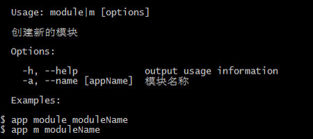
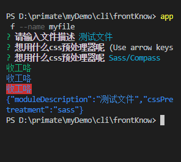
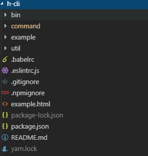

# 脚手架

## 1 前置知识

### 1.1 commander 包

> 它提供了用户命令行输入和参数解析的强大功能，可以帮助我们简化命令行开发。

- 参数解析
- 强制多态
- 可变参数
- Git 风格的子命令
- 自动化帮助信息
- 自定义帮助等

举个栗子,生成个 app.js，使用`node app.js m app`来运行：

```js
const program = require('commander')
// const inquirer = require('inquirer')
const chalk = require('chalk')
// const success = (...args) => {
//   console.log(chalk.green(...args))
// }
program
  .command('module') //义命令行指令，后面可跟上一个name，用空格隔开，如 .command( ‘app [name] ‘)
  .alias('m') // 定义一个更短的命令行指令 ，如执行命令$ app m 与之是等价的
  .description('创建模块') // 描述，它会在help里面展示
  .option(
    '-a --name [moduleName]',
    '模块名称',
    a => {
      console.log('---option', a)
    },
    'ccc'
  ) //定义参数。它接受四个参数，在第一个参数中，它可输入短名字 -a和长名字–app ,使用 | 或者,分隔，在命令行里使用时，这两个是等价的，区别是后者可以在程序里通过回调获取到；第二个为描述, 会在 help 信息里展示出来；第三个参数为回调函数，他接收的参数为一个string，有时候我们需要一个命令行创建多个模块，就需要一个回调来处理；第四个参数为默认值
  .action(a => {
    //注册一个callback函数,这里需注意目前回调不支持let声明变量
    console.log(chalk.green('hello', a))
  })
  .on('--help', () => {
    success('example')
    success(`app module modulename`)
    success(`app m modulename`)
  })

program.parse(process.argv) //– 解析命令行

if (!program.args.length) {
  program.help()
}
```

为了方便运行，将演示的文件加入到 package.json 里的 bin 字段，并且`npm link`到全局

```json
"bin": {
    "app": "app"
 }
```

```js
#! /usr/bin/env node #表明这是一个可执行的应用
const program = require('commander')
const inquirer = require('inquirer')
const chalk = require('chalk')
const success = (...args) => {
  console.log(chalk.green(...args))
}
program
  .command('module') // 定义命令行指令，后面可跟上一个name，用空格隔开，如 .command( ‘app [name] ‘)
  .alias('m') // 定义一个更短的命令行指令 ，如执行命令$ app m 与之是等价的
  .description('创建模块') //  描述，它会在help里面展示
  .option(
    '-a --name [moduleName]',
    '模块名称',
    a => {
      console.log('---option', a)
    },
    'ccc'
  ) //定义参数。它接受四个参数，在第一个参数中，它可输入短名字 -a和长名字–app ,使用 | 或者,分隔，在命令行里使用时，这两个是等价的，区别是后者可以在程序里通过回调获取到；第二个为描述, 会在 help 信息里展示出来；第三个参数为回调函数，他接收的参数为一个string，有时候我们需要一个命令行创建多个模块，就需要一个回调来处理；第四个参数为默认值
  .action(a => {
    //注册一个callback函数,这里需注意目前回调不支持let声明变量
    console.log(chalk.green('hello', a))
  })
  .on('--help', () => {
    // 自定义生成帮助信息
    success('example')
    success(`app module modulename`)
    success(`app m modulename`)
  })

program.parse(process.argv) //– 解析命令行

if (!program.args.length) {
  program.help()
}
```

运行 `app m -help`<br>


### 2 inquirer 包

> 在开发的过程中，我们需要频繁的跟命令行进行交互，借助 inquirer 这个模块就能轻松实现，它提供了用户界面和查询会话流程

语法

```js
var inquirer = require('inquirer')
inquirer
  .prompt([
    /* Pass your questions in here */
  ])
  .then(function(answers) {
    // Use user feedback for... whatever!!
  })
```

**inquirer 功能简介**

- input–输入
- validate–验证
- list–列表选项
- confirm–提示
- checkbox–复选框等等

举个栗子：

```js
#! /usr/bin/env node
const program = require('commander')
const inquirer = require('inquirer')
const chalk = require('chalk')
const success = (...args) => {
  console.log(chalk.green(...args))
}
program
  .command('file')
  .alias('f')
  .description('创建一个文件')
  .option('--name [fileName]') // 关于option的使用，在使用命令时添加参数 --name myfile 就欧克
  .option('--sass', '启用sass') // --sass 则sass为true
  .option('--less', '启用less')
  .action(option => {
    const config = Object.assign(
      {
        name: null,
        description: '',
        less: false,
        sass: false
      },
      option
    )
    const promps = []
    if (!config.filename) {
      promps.push({
        type: 'input',
        name: 'moduleName',
        message: '请输入模块名称',
        validate: function(input) {
          if (!input) {
            return '不能为空'
          }
          return true
        }
      })
    }
    if (config.description !== 'string') {
      promps.push({
        type: 'input',
        name: 'moduleDescription',
        message: '请输入模块描述'
      })
    }
    if (config.sass === false && config.less === false) {
      promps.push({
        type: 'list',
        name: 'cssPretreatment',
        message: '想用什么css预处理器呢',
        choices: [
          {
            name: 'Sass/Compass',
            value: 'sass'
          },
          {
            name: 'Less',
            value: 'less'
          }
        ]
      })
    }
    inquirer.prompt(promps).then(function(answers) {
      console.log(chalk.green('收工咯'))
      console.log(chalk.blue('收工咯'))
      console.log(chalk.blue.bgRed('收工咯')) //支持设置背景
      console.log(chalk.blue(JSON.stringify(answers)))
    })
  })

program.parse(process.argv) //– 解析命令行

if (!program.args.length) {
  program.help()
}
```

显示结果如下<br>



### 3 chalk 模块

> chalk 美化命令行的模块，它具有轻量级、高性能、学习成本低等特点。

```js
console.log(chalk.green('收工咯'))
console.log(chalk.blue('收工咯'))
console.log(chalk.blue.bgRed('收工咯')) //支持设置背景
console.log(chalk.blue(answers))
```

## 2 开始一个脚手架

类似于 vue-cli,create-react-app 等脚手架，通过脚手架，我们可以快速初始化一个项目，无需自己从零开始一步步配置，有效提升开发体验。<br>
**脚手架的作用：**

- 减少重复性的工作，不需要复制其他项目再删除无关代码，或者从零创建一个项目和文件。
- 可以根据交互动态生成项目结构和配置文件。

此次实现的脚手架是一个 vue 多页面的脚手架，包含以下功能：

- create,新建项目，从远程拉取页面模板
- init,初始化项目
- page,新建一个 vue 页面
- route,给指定页面新建路由
- update,更新脚手架(暂时未做，因为模板的打包暂时没有拆开，而是类似于 vue-cli2 那种集成在模板内部，后续将打包和模板拆分开来)

文件夹目录如下：<br>

接下来就是实现这些命令了。为了测试这些命令，最好使用`npm link`，将该命令行变成全局。

## 3 脚本入口

```js
#!/usr/bin/env node
// 编写指令
const program = require('commander')

program.version(require('../package').version)
program
  .command('create')
  .description('创建一个新工程')
  .alias('c')
  .action(() => {
    require('../command/create.js')()
  })
program
  .command('route')
  .description('新建路由')
  .alias('r')
  .action(() => {
    require('../command/route.js')()
  })
program
  .command('page')
  .description('新建页面')
  .alias('p')
  .action(() => {
    require('../command/page.js')()
  })
program
  .command('init')
  .description('初始化一个空的工程')
  .alias('i')
  .action(() => {
    require('../command/init.js')()
  })

// 解析命令行参数
program.parse(process.argv)
if (!program.args.length) {
  program.help()
}
```

## 4 create 命令

> create 命令的使用方法，`hkx create projectName`

实现思路

- 拿到工程名称，如果命令后面没有工程名称，那么就询问且输入工程名称
- 判断工程名称是否合法，判断该名称的文件夹是否存在
- 工程名称合法后，拉取远程模板代码
- 远程模板代码下载完毕后，移除`.git`文件夹，下载依赖包
- 一切完毕后，给个 tip 来提示运行命令

代码如下：

```js
// create.js
const inquirer = require('inquirer')
const fs = require('fs-extra') //fs的一个扩展，提供了非常多的便利API，并且继承了fs所有方法和为fs方法添加了promise的支持。
const { join } = require('path')
const ora = require('ora') // loading
const { shell } = require('execa') //execa是更好的子进程管理工具（A better child_process）。本质上就是衍生一个 shell，传入的 command 字符串在该 shell 中直接处理。

const { success, err, installDep } = require('../util/tool')
const { GIT_VUE_PAHT } = require('../util/path')
// 获取工程名称
async function getProName() {
  const { _projectName } = await inquirer.prompt([
    {
      type: 'input',
      name: '_projectName',
      message: '你想创建的工程名称：',
      validate(val) {
        if (val === '') {
          return 'Name is required!'
        } else if (fs.pathExistsSync(join(CWD, val))) {
          return `${val} has already existed!`
        } else {
          return true
        }
      }
    }
  ])
  return _projectName
}
module.exports = async function() {
  let projectName = process.argv[3] || ''
  const CWD = process.cwd()
  if (projectName && fs.pathExistsSync(join(CWD, projectName))) {
    err(`${projectName} 已经存在，请输入新的名称`)
    const _projectName = await getProName()
    projectName = _projectName
  } else if (!projectName) {
    const _projectName = await getProName()
    projectName = _projectName
  }

  const spinner = ora('创建工程中...')
  spinner.start()

  try {
    const projectPath = join(CWD, projectName)
    await shell(`git clone -b master ${GIT_VUE_PAHT} ${projectName}`)
    fs.remove(join(projectName, '.git'))
    await installDep(projectName)
    success('\n  创建成功,执行以下命令,启动项目')
    success(`\n  cd ${projectName} && npm run dev`)
    spinner.stop()
  } catch (error) {
    err(error)
    spinner.stop()
  }
}
```

## 5 init 命令

> init 命令的使用方法，`hkx init`

实现思路与 create 类似，只不过不用获取工程名称（文件夹）

代码如下：

```js
// init.js
const inquirer = require('inquirer')
const fs = require('fs-extra')
const { join } = require('path')
const { shell } = require('execa')
const ora = require('ora')
const { success, err, writeHkxConfig, hasYarn } = require('../util/tool')
const { __SRC_PATH, __PAGE_PATH, GIT_VUE_PAHT } = require('../util/path')

module.exports = async () => {
  const spinner = ora('正在初始化...')
  spinner.start()
  try {
    await shell(`git clone -b master ${GIT_VUE_PAHT} ${join(__dirname, 'tmp')}`)
    await fs.remove(join(__dirname, './tmp/.git'))
    const CWD = process.cwd()
    await fs.copy(join(__dirname, 'tmp'), CWD)
    await fs.remove(join(__dirname, 'tmp'))
    const __packageLock = join(CWD, 'package-lock.json')
    if (fs.pathExistsSync(__packageLock)) {
      await fs.remove(__packageLock)
    }
    const yarnLockPath = join(CWD, 'yarn.lock')
    if (fs.pathExistsSync(yarnLockPath)) {
      await fs.remove(yarnLockPath)
    }
    await shell(hasYarn() ? `yarn` : `npm i`)
    spinner.stop()
    success('\n 初始化成功')
    success('\n 使用 npm run dev 运行项目')
  } catch (error) {
    spinner.stop()
    err(error)
  }
}
```

## 6 page 命令

> page 命令的使用方法，`hkx page [pageName]`

实现思路

- 拿到页面名称，如果命令后面没有页面名称，那么就询问且输入页面名称
- 判断页面名称是否合法，判断该页面名称的文件夹是否存在
- 工程名称合法后，将脚手架中的`example`文件夹拷贝到项目的新页面目录中(此处的`example`应该放在远程模板中比较合适，此处为了演示，后续修改成远程)
- 修改项目中的配置文件，复制`html`文件
- 一切完毕后，给个 tip 来提示页面创建成功

代码如下：

```js
const inquirer = require('inquirer')
const fs = require('fs-extra')
const { join } = require('path')
const ora = require('ora')
const { success, err, writeHkxConfig } = require('../util/tool')
const { __SRC_PATH, __PAGE_PATH } = require('../util/path')

/**
 * 询问页面
 */
async function getPageName(pageName) {
  const { _pageName } = await inquirer.prompt([
    {
      type: 'input',
      name: '_pageName',
      message: pageName
        ? `${pageName}已存在，请重新输入：`
        : `请输入新页面的名称：`,
      validate(val) {
        if (val === '') {
          return '页面不能为空！'
        } else if (existPage(val)) {
          return `${val} 页面已存在！`
        } else {
          return true
        }
      }
    }
  ])
  return _pageName
}
function existPage(pagename) {
  return fs.pathExistsSync(join(__SRC_PATH, pagename))
}
function copyHtml(pagename) {
  try {
    let html = fs.readFileSync(join(__dirname, '../example.html'), 'utf-8')
    html = html.replace(
      /<title>([\s\S]*)<\/title>/,
      `<title>${pagename}<\/title>`
    )
    fs.writeFileSync(join(__PAGE_PATH, `${pagename}.html`), html)
  } catch (error) {}
}
module.exports = async () => {
  let pageName = process.argv[3]
  if (!pageName || existPage(pageName)) {
    pageName = await getPageName(pageName)
  }
  const spinner = ora('正在创建...')
  spinner.start()
  try {
    const src = join(__dirname, '../example')
    const dest = join(__SRC_PATH, pageName)
    // 复制文件
    fs.copySync(src, dest)
    // 修改config
    writeHkxConfig(pageName)
    copyHtml(pageName)
    spinner.stop()
    success(`\n ${pageName}页面创建成功`)
  } catch (error) {
    spinner.stop()
    err(error)
  }
}
```

## 7 route 命令

> page 命令的使用方法，`hkx route [routeName]`

实现思路

- 拿到页面名称，判断页面是否合法且已经存在
- 拿到路由名称，判断路由是否合法且不存在
- 页面和路由都拿到后，修改该页面下的 router.js，增加路由
- 将`example`文件夹里的路由文件 copy 到路由名称的文件夹
- 一切完毕后，给个 tip 来提示页面创建成功

代码如下：

```js
const inquirer = require('inquirer')
const fs = require('fs-extra')
const { join } = require('path')
const ora = require('ora')
const { success, err, normalizeEntry } = require('../util/tool')
const { __HKX_CONFIG, __SRC_PATH } = require('../util/path')
const { entry } = require(__HKX_CONFIG)
/**
 * 询问路由名称
 * @param {String} page         页面名称
 * @param {String} routeName    路由名称
 */
async function getRouteName(page, routeName) {
  const { _routeName } = await inquirer.prompt([
    {
      type: 'input',
      name: '_routeName',
      message: routeName
        ? `${routeName}路由已存在，请输入新的路由`
        : '你想创建的路由名称：',
      validate(val) {
        if (val === '') {
          return '请输入路由名称！'
        } else if (existRoute(page, routeName)) {
          return `${routeName}路由已存在,请重新输入`
        } else {
          return true
        }
      }
    }
  ])
  return _routeName
}
/**
 * 询问页面
 */
async function getPageName() {
  const { _pageName } = await inquirer.prompt([
    {
      type: 'input',
      name: '_pageName',
      message: '你想为哪个页面创建路由：',
      validate(val) {
        if (val === '') {
          return '页面不能为空！'
        } else if (!fs.pathExistsSync(join(__SRC_PATH, val))) {
          return `${val} 页面不存在！`
        } else {
          return true
        }
      }
    }
  ])
  return _pageName
}
function existRoute(page, route) {
  return !!fs.pathExistsSync(join(__SRC_PATH, page, 'views', route))
}
/**
 * 询问确认在这页面创建路由
 * @param {String} pageName
 */
async function questionAgain(pageName) {
  const { _pageName } = await inquirer.prompt([
    {
      type: 'input',
      name: '_pageName',
      message: `即将为${pageName}页面创建路由，你可以再次修改`,
      default: pageName,
      validate(val) {
        if (!val) {
          return '页面不能为空！'
        } else if (!fs.pathExistsSync(join(__SRC_PATH, val))) {
          return `${val} 页面不存在！`
        } else {
          return true
        }
      }
    }
  ])
  return _pageName
}
module.exports = async () => {
  let routeName = process.argv[3] || ''
  let pageName = process.argv[4] || normalizeEntry(entry)

  if (!pageName) {
    pageName = await getPageName()
  }
  if (!routeName || existRoute(pageName, routeName)) {
    routeName = await getRouteName(pageName, routeName)
  }

  pageName = await questionAgain(pageName)
  /** 拿到页面名称和路由名称 **/
  const spinner = ora('正在创建路由...')
  spinner.start()
  try {
    const routeRgx = /routes:\s*\[([\s\S]*)\]/
    let routeInfo = fs.readFileSync(
      join(__SRC_PATH, pageName, 'router', 'index.js'),
      {
        encoding: 'utf-8'
      }
    )
    routeInfo = routeInfo.replace(routeRgx, (match, $1) => {
      const flag = $1.trim().endsWith(',')
      return `routes: [
    ${$1.trim()}${flag ? '' : ','}
    {
      path: '/${routeName}',
      name: '${routeName}',
      meta: {
        title: '${routeName}'
      },
      component: () => import(/* webpackChunkName: "${pageName}/route.${routeName}" */'../views/${routeName}')
    }
  ]`
    })
    fs.writeFileSync(
      join(__SRC_PATH, pageName, 'router', 'index.js'),
      routeInfo
    )
    fs.copySync(
      join(__dirname, '..', 'example', 'views', 'index'),
      join(__SRC_PATH, pageName, 'views', routeName)
    )
    spinner.stop()
    success('\n 路由创建成功')
  } catch (error) {
    spinner.stop()
    err(error)
  }
}
```
