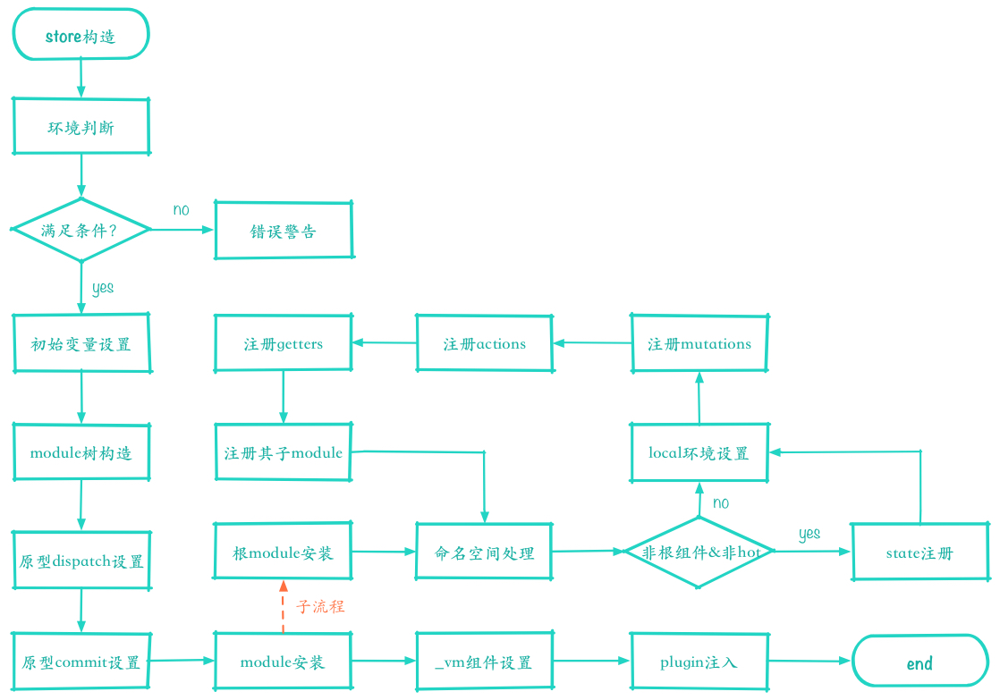

# vuex

> vuex 的版本为 3.4.0

## 1 入口分析

`umd`版本的路口为`index.cjs`，默认导出了一个大对象

```js
import { Store, install } from './store'
import {
  mapState,
  mapMutations,
  mapGetters,
  mapActions,
  createNamespacedHelpers
} from './helpers'

export default {
  Store,
  install,
  version: '__VERSION__',
  mapState,
  mapMutations,
  mapGetters,
  mapActions,
  createNamespacedHelpers
}
```

## 2 install 方法

```js
export function install(_Vue) {
  if (Vue && _Vue === Vue) {
    if (__DEV__) {
      console.error(
        '[vuex] already installed. Vue.use(Vuex) should be called only once.'
      )
    }
    return
  }
  Vue = _Vue
  applyMixin(Vue)
}
```

- 1 判断是否已经安装过`vuex`，已经安装过发出一个错误提示，没有安装就调用`applyMixin`方法
  **mixin.js** applyMixin 方法

```js
export default function(Vue) {
  const version = Number(Vue.version.split('.')[0])
  //  vue 版本大于2，全局注入一个beforeCreate的mixin
  if (version >= 2) {
    Vue.mixin({ beforeCreate: vuexInit })
  } else {
    // 1.x的vue版本装饰_init方法，将vuexInit函数注入到options.init中
    const _init = Vue.prototype._init
    Vue.prototype._init = function(options = {}) {
      options.init = options.init ? [vuexInit].concat(options.init) : vuexInit
      _init.call(this, options)
    }
  }

  /**
   * Vuex init hook, injected into each instances init hooks list.
   */

  function vuexInit() {
    const options = this.$options
    // new Vue()时的store配置，如果有就给vue的示例赋值$store属性
    if (options.store) {
      this.$store =
        typeof options.store === 'function' ? options.store() : options.store
    } else if (options.parent && options.parent.$store) {
      // 针对vue单页面的组件，从父组件中拿$store并给该实例赋值$store，这会让不管多深的子组件都会赋值$store属性
      this.$store = options.parent.$store
    }
  }
}
```

## 3 Store 类分析

`store`实例化流程图


## 3.1 环境判断

```js
// 自动安装一次vuex
if (!Vue && typeof window !== 'undefined' && window.Vue) {
  install(window.Vue)
}
// 开发环境的一些提示
if (__DEV__) {
  // 必须先有Vue，调用install时会赋值Vue
  assert(Vue, `must call Vue.use(Vuex) before creating a store instance.`)
  // 要支持promise
  assert(
    typeof Promise !== 'undefined',
    `vuex requires a Promise polyfill in this browser.`
  )
  // 只能new实例化调用
  assert(this instanceof Store, `store must be called with the new operator.`)
}
```

## 3.2 初始化变量

```js
// store internal state
// 开启严格模式时的变量控制，修改state时必须通过mutation
this._committing = false
// actions
this._actions = Object.create(null)
// 监听dispatch的函数，有before，after，error钩子函数,即再action之前，之后，错误时调用
this._actionSubscribers = []
this._mutations = Object.create(null)
this._wrappedGetters = Object.create(null)
// 收集modules,有个root属性代表根module,如果options配置项有modules，递归遍历modules，并给各个module分配好child module
this._modules = new ModuleCollection(options)
this._modulesNamespaceMap = Object.create(null)
// 订阅mutation，会在mutation之后执行
this._subscribers = []
// 在store.watch方法中使用
this._watcherVM = new Vue()
// localStore的Getters缓存对象
this._makeLocalGettersCache = Object.create(null)
```

- `module` 的构造，进入`module-collection.js`,查看其`register`方法

```js
export default class ModuleCollection {
  constructor(rawRootModule) {
    // register root module (Vuex.Store options)
    // 注册根module
    this.register([], rawRootModule, false)
  }
  // 注册module，设置各module之间的关系
  register(path, rawModule, runtime = true) {
    if (__DEV__) {
      // 开发环境中判断瞎module的配置是否符合规范
      assertRawModule(path, rawModule)
    }
    // 实例一个module
    const newModule = new Module(rawModule, runtime)
    if (path.length === 0) {
      // 赋值根module
      this.root = newModule
    } else {
      // 如果是子module，先拿到上一层的module，并将子module添加到父module的_children中，_children是一个对象，每个key为子模块的name
      const parent = this.get(path.slice(0, -1))
      parent.addChild(path[path.length - 1], newModule)
    }

    // register nested modules
    // 如果配置中还有modules，递归的注册module
    if (rawModule.modules) {
      forEachValue(rawModule.modules, (rawChildModule, key) => {
        this.register(path.concat(key), rawChildModule, runtime)
      })
    }
  }
}
```

## 3.3 分析 module.js

```js
// 主要是对module._children的增删改，和一些遍历的方法
export default class Module {
  constructor(rawModule, runtime) {
    this.runtime = runtime
    // Store some children item
    this._children = Object.create(null)
    // Store the origin module object which passed by programmer
    this._rawModule = rawModule
    const rawState = rawModule.state

    // Store the origin module's state
    this.state = (typeof rawState === 'function' ? rawState() : rawState) || {}
  }
  addChild(key, module) {
    this._children[key] = module
  }

  removeChild(key) {
    delete this._children[key]
  }

  getChild(key) {
    return this._children[key]
  }

  hasChild(key) {
    return key in this._children
  }

  update(rawModule) {
    this._rawModule.namespaced = rawModule.namespaced
    if (rawModule.actions) {
      this._rawModule.actions = rawModule.actions
    }
    if (rawModule.mutations) {
      this._rawModule.mutations = rawModule.mutations
    }
    if (rawModule.getters) {
      this._rawModule.getters = rawModule.getters
    }
  }
  forEachChild(fn) {
    forEachValue(this._children, fn)
  }

  forEachGetter(fn) {
    if (this._rawModule.getters) {
      forEachValue(this._rawModule.getters, fn)
    }
  }

  forEachAction(fn) {
    if (this._rawModule.actions) {
      forEachValue(this._rawModule.actions, fn)
    }
  }

  forEachMutation(fn) {
    if (this._rawModule.mutations) {
      forEachValue(this._rawModule.mutations, fn)
    }
  }
}
```

## 3.4 dispathc 和 commit 的设置

```js
// 将dispatch和commit的this指向store
this.dispatch = function boundDispatch(type, payload) {
  return dispatch.call(store, type, payload)
}
this.commit = function boundCommit(type, payload, options) {
  return commit.call(store, type, payload, options)
}
```

```js
 commit(_type, _payload, _options) {
    // check object-style commit
    // 获取到正确的参数
    const { type, payload, options } = unifyObjectStyle(
      _type,
      _payload,
      _options
    )

    const mutation = { type, payload }
    const entry = this._mutations[type]
    if (!entry) {
      if (__DEV__) {
        console.error(`[vuex] unknown mutation type: ${type}`)
      }
      return
    }
    // 使用_withCommit函数执行
    this._withCommit(() => {
      entry.forEach(function commitIterator(handler) {
        handler(payload)
      })
    })
    // 执行mutation的监听函数
    this._subscribers
      .slice() // shallow copy to prevent iterator invalidation if subscriber synchronously calls unsubscribe
      .forEach(sub => sub(mutation, this.state))

    if (__DEV__ && options && options.silent) {
      console.warn(
        `[vuex] mutation type: ${type}. Silent option has been removed. ` +
          'Use the filter functionality in the vue-devtools'
      )
    }
  }
```

```js
 dispatch(_type, _payload) {
    // check object-style dispatch
    // 序列化type，payload参数，有两种传参方式
    const { type, payload } = unifyObjectStyle(_type, _payload)

    const action = { type, payload }
    const entry = this._actions[type]
    if (!entry) {
      if (__DEV__) {
        console.error(`[vuex] unknown action type: ${type}`)
      }
      return
    }
    // before订阅函数调用
    try {
      this._actionSubscribers
        .slice() // shallow copy to prevent iterator invalidation if subscriber synchronously calls unsubscribe
        .filter(sub => sub.before)
        .forEach(sub => sub.before(action, this.state))
    } catch (e) {
      if (__DEV__) {
        console.warn(`[vuex] error in before action subscribers: `)
        console.error(e)
      }
    }
    // 执行action,action在installModule方法中经过包装，返回值为一个promise
    const result =
      entry.length > 1
        ? Promise.all(entry.map(handler => handler(payload)))
        : entry[0](payload)
    // 返回一个promise
    return new Promise((resolve, reject) => {
      result.then(
        res => {
          // 执行after监听函数
          try {
            this._actionSubscribers
              .filter(sub => sub.after)
              .forEach(sub => sub.after(action, this.state))
          } catch (e) {
            if (__DEV__) {
              console.warn(`[vuex] error in after action subscribers: `)
              console.error(e)
            }
          }
          resolve(res)
        },
        error => {
          try {
            // 执行error监听函数
            this._actionSubscribers
              .filter(sub => sub.error)
              .forEach(sub => sub.error(action, this.state, error))
          } catch (e) {
            if (__DEV__) {
              console.warn(`[vuex] error in error action subscribers: `)
              console.error(e)
            }
          }
          reject(error)
        }
      )
    })
  }

```

## 3.5 installModule 分析

来到了 store 的重头戏，`installModule`方法，该方法的作用如下：

- 1 给 store.\_modulesNamespaceMap 赋值
- 2 设置 parentState 的值{[modulename]:state}
- 3 得到一个本地的 store 上下文
- 4 注册 mutations，actions，getters
- 5 对子 module 递归的执行该方法

```js
function installModule(store, rootState, path, module, hot) {
  const isRoot = !path.length
  const namespace = store._modules.getNamespace(path)

  // register in namespace map
  // 如果需要命名空间，就注册namespacemap
  if (module.namespaced) {
    // 重复命名空间警告并替换module
    if (store._modulesNamespaceMap[namespace] && __DEV__) {
      console.error(
        `[vuex] duplicate namespace ${namespace} for the namespaced module ${path.join(
          '/'
        )}`
      )
    }
    store._modulesNamespaceMap[namespace] = module
  }

  // set state
  if (!isRoot && !hot) {
    const parentState = getNestedState(rootState, path.slice(0, -1))
    const moduleName = path[path.length - 1]
    // 给父module的state设置子modulename的值为子module.state
    store._withCommit(() => {
      if (__DEV__) {
        if (moduleName in parentState) {
          console.warn(
            `[vuex] state field "${moduleName}" was overridden by a module with the same name at "${path.join(
              '.'
            )}"`
          )
        }
      }
      Vue.set(parentState, moduleName, module.state)
    })
  }
  // 获取个localStore，{dispatch,commit,getters,state}如果没有命名空间，dispatch和commit都是走store的。
  // 存在命名空间，就给dispatch,commit的type加上命名空间,
  // getters会去掉命名空间的前缀，使用local里的真正type，但是读取的值还是store里的命名空间+type,state没啥区别。
  const local = (module.context = makeLocalContext(store, namespace, path))
  // 注册mutations,给store._mutations push mutations 并传递对应的参数
  module.forEachMutation((mutation, key) => {
    const namespacedType = namespace + key
    registerMutation(store, namespacedType, mutation, local)
  })
  // 注册actions，给_actions push actions 并传递对应的参数
  module.forEachAction((action, key) => {
    const type = action.root ? key : namespace + key
    const handler = action.handler || action
    registerAction(store, type, handler, local)
  })
  // 注册getters，_wrappedGetters push getters,并传递对应的参数
  module.forEachGetter((getter, key) => {
    const namespacedType = namespace + key
    registerGetter(store, namespacedType, getter, local)
  })
  // 递归的注册module
  module.forEachChild((child, key) => {
    installModule(store, rootState, path.concat(key), child, hot)
  })
}
```

以下三个方法为了封装`Mutation Action Getter`，这也是为什么我们给`store`传入`mutation action getter`时，可以使用`state store`等参数

```js
function registerMutation(store, type, handler, local) {
  const entry = store._mutations[type] || (store._mutations[type] = [])
  entry.push(function wrappedMutationHandler(payload) {
    // 执行的时候传入state,payload参数
    handler.call(store, local.state, payload)
  })
}

function registerAction(store, type, handler, local) {
  const entry = store._actions[type] || (store._actions[type] = [])
  entry.push(function wrappedActionHandler(payload) {
    // 执行时传入 {dispatch: local.dispatch,commit: local.commit, getters: local.getters,state: local.state,rootGetters: store.getters,rootState: store.state}参数
    let res = handler.call(
      store,
      {
        dispatch: local.dispatch,
        commit: local.commit,
        getters: local.getters,
        state: local.state,
        rootGetters: store.getters,
        rootState: store.state
      },
      payload
    )
    // 将执行结果转化成promise
    if (!isPromise(res)) {
      res = Promise.resolve(res)
    }
    if (store._devtoolHook) {
      return res.catch(err => {
        store._devtoolHook.emit('vuex:error', err)
        throw err
      })
    } else {
      return res
    }
  })
}

function registerGetter(store, type, rawGetter, local) {
  if (store._wrappedGetters[type]) {
    if (__DEV__) {
      console.error(`[vuex] duplicate getter key: ${type}`)
    }
    return
  }
  store._wrappedGetters[type] = function wrappedGetter(store) {
    return rawGetter(
      local.state, // local state
      local.getters, // local getters
      store.state, // root state
      store.getters // root getters
    )
  }
}
```

## 3.6 resetStoreVM 分析

实例化了一个 `vue` 对象，并将该 `vue` 实例赋值给 `store._vm`，该 `vue` 示例包含`store.getters`，即 `getters` 就是 `vue` 的 `computed`,`state` 就是 `vue` 里的 `data.$$state`

```js
function resetStoreVM(store, state, hot) {
  const oldVm = store._vm

  // bind store public getters
  store.getters = {}
  // reset local getters cache
  store._makeLocalGettersCache = Object.create(null)
  const wrappedGetters = store._wrappedGetters
  const computed = {}
  // 定义getters，走的都是vue的computed
  forEachValue(wrappedGetters, (fn, key) => {
    // use computed to leverage its lazy-caching mechanism
    // direct inline function use will lead to closure preserving oldVm.
    // using partial to return function with only arguments preserved in closure environment.
    computed[key] = partial(fn, store)

    Object.defineProperty(store.getters, key, {
      get: () => store._vm[key],
      enumerable: true // for local getters
    })
  })

  // use a Vue instance to store the state tree
  // suppress warnings just in case the user has added
  // some funky global mixins
  const silent = Vue.config.silent
  Vue.config.silent = true
  // 赋值vue示例，并将state和getters赋值
  store._vm = new Vue({
    data: {
      $$state: state
    },
    computed
  })
  Vue.config.silent = silent

  // enable strict mode for new vm
  // 开启严格模式，严格摸下只能使用commit提交mutation修改state的，其他的方式修改会报错提示
  if (store.strict) {
    enableStrictMode(store)
  }

  if (oldVm) {
    if (hot) {
      // dispatch changes in all subscribed watchers
      // to force getter re-evaluation for hot reloading.
      store._withCommit(() => {
        oldVm._data.$$state = null
      })
    }
    Vue.nextTick(() => oldVm.$destroy())
  }
}
```

## 3.7 enableStrictMode 分析

```js
/**
 * 监听state的变化，如果不是commit来修改state，发出警告
 * @param {*} store
 */
function enableStrictMode(store) {
  store._vm.$watch(
    function() {
      return this._data.$$state
    },
    () => {
      if (__DEV__) {
        assert(
          store._committing,
          `do not mutate vuex store state outside mutation handlers.`
        )
      }
    },
    { deep: true, sync: true }
  )
}
```

## 3.8 vuex 的浏览器插件

所以最好通过`commit mutation`来修改`state`，方便插件记录

```js
const target =
  typeof window !== 'undefined'
    ? window
    : typeof global !== 'undefined'
    ? global
    : {}
const devtoolHook = target.__VUE_DEVTOOLS_GLOBAL_HOOK__

export default function devtoolPlugin(store) {
  if (!devtoolHook) return

  store._devtoolHook = devtoolHook

  devtoolHook.emit('vuex:init', store)

  devtoolHook.on('vuex:travel-to-state', targetState => {
    store.replaceState(targetState)
  })
  store.subscribe(
    (mutation, state) => {
      // commit后，发出通知
      devtoolHook.emit('vuex:mutation', mutation, state)
    },
    { prepend: true }
  )

  store.subscribeAction(
    (action, state) => {
      // 发出action通知
      devtoolHook.emit('vuex:action', action, state)
    },
    { prepend: true }
  )
}
```

```

```
