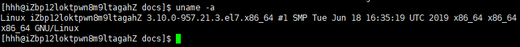
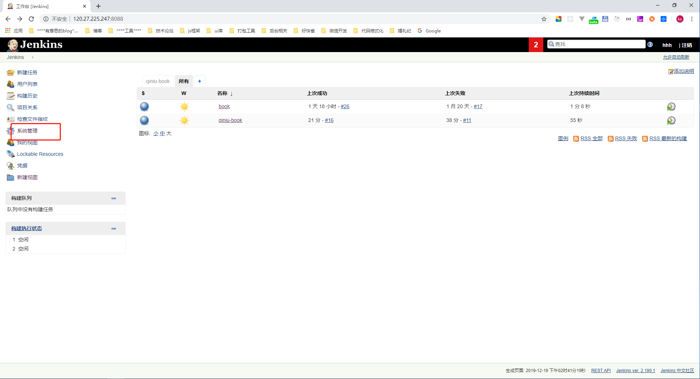
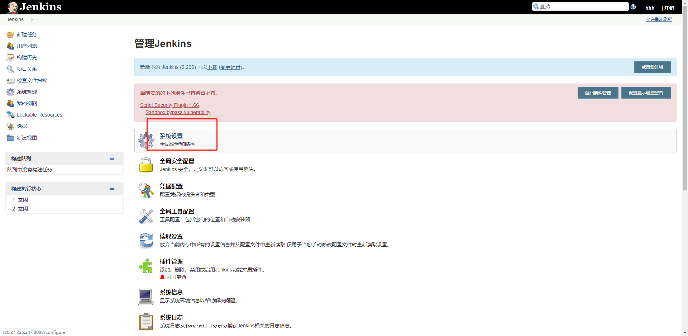
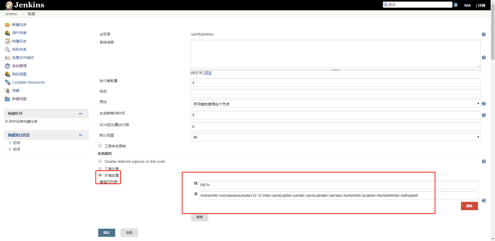

# jenkins 上传文件到七牛云

## 下载 qshell

- 1 进入 root 目录,新建文件夹 soft/qshell，下载对应的版本，使用`uname -a`查看 linux 对应的版本，下载 x86-64 位的；
  
- 2 进入到/soft/qshell,下载 qshell,没有 unzip 的要下载 zip 和 unzip,`sudo yum install -y unzip zip`

```sh
wget http://devtools.qiniu.com/qshell-linux-x64-v2.4.0.zip?ref=developer.qiniu.com
unzip qshell-linux-x64-v2.4.0.zip

#重新命名
mv qshell-linux-x64-v2.4.0 qshell
#给权限
chmod +x qshell

#然后查看下目录，方便设置环境变量
pwd

/root/qshell

#设置环境变量，有三种方式，我们采用对所有系统用户生效，永久生效
vi /etc/profile
#在末尾添加如下,注意自己 qshell 的路径

#然后执行
qshel
```

- 3 配置 qshell

```sh

#首先我们需要添加公钥密钥和账号：
#命令如下，请注意更换成自己的密钥
#ak 和 sk https://portal.qiniu.com/user/key 查看， name 代表自己的七牛账号
qshell account ak sk name
```

- 4 在 jenkins 中使用 qshell,要将服务器上的环境变量配置到 jenkins 上
  - 4.1 获取全局变量,输出`$PATH`
  - 4.2 在 jenkins 上将输出的`$PATH`，设置到`系统管理=》系统设置=》环境变量=》键\值`
    
    
    

## 坑点

- 1 jenkins 中第一次使用 qshell，提示没有 ak、sk，但是在服务器已经设置过一次，可能设置的方法不对，在 jenkins 又设置了一次才行；
- 2 构建时，要给文件夹赋权限，`chmod -R 777 *`

## 参考

[Linux 64 位 Centos7 使用七牛 qshell 教程](https://blog.csdn.net/myarche/article/details/96098122)<br>
[jenkins 执行脚本 npm: command not found 解决](https://blog.csdn.net/u011296165/article/details/96110294)<br>
