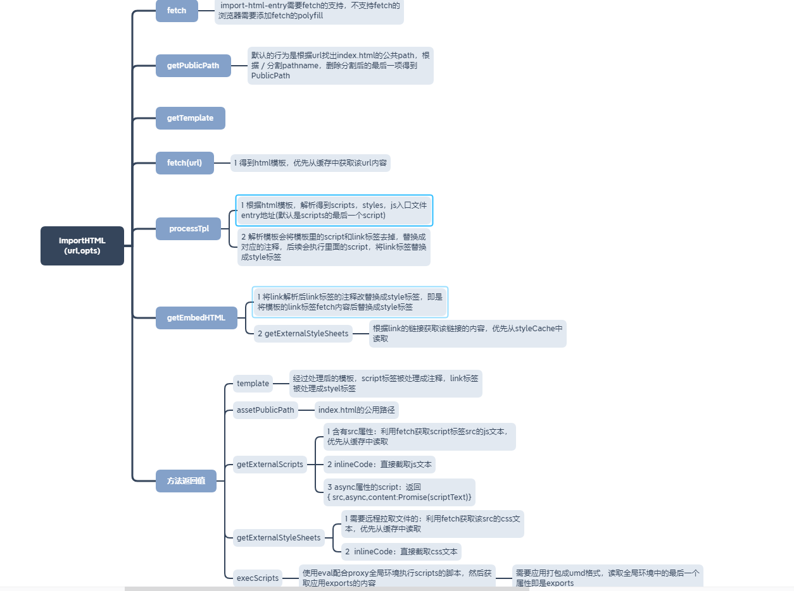

# import-html-entrymd

> `import-html-entry`处理`index.html`，并加载静态资源，包含`js css` 
> [import-html-entry 地址](https://github.com/kuitos/import-html-entry)

## 流程

> `import-html-entry`需要`window.fetch`，如果当前浏览器环境不支持`fetch`，需要引入`fetch`的`polyfill`

1. **importHTML**流程
   > 根据`url`获取`html`内容，返回处理好的`template assetPublicPath`值，
   > 及`getExternalScripts getExternalStyleSheets execScripts`方法

- 获取参数`fetch getPublicPath getTemplate`，
  - `fetch`的默认值是`window.fetch`
  - `getPublicPath`的默认值是获取`entry`的`origin`+`pathName`移除最后一个`path`
  - `getTemplate`的默认值是`tpl=>tpl`
- 优先从`embedHTMLCache`读取缓存的值
- 没有缓存过的`url`会`fetch`该`url`获得`html`内容，解析`html`模板获取`scripts styles entry`和处理过的`template`。最后返
  回一个对象
  - 使用`fetch`获取该`url`的`html`内容字符串
  - 使用`getPublicPath`获得`assetPublicPath`
  - 根据`template assetPublicPath`解析`template`模板获得处理过的`template`和该`html`包含的`script link style`标
    签`scripts styles`，还获得该`html`文件的`script entry`文件地址
  - 调用`getEmbedHTML`方法，对`link`标签的 css 做替换，将`link`标签替换成对应的`style`标签
  - 处理后，返回一个对象，包含`template assetPublicPath getExternalScripts getExternalStyleSheets execScripts`
    - `template`处理后的`html`模板，里面的`link`css 标签被替换成`style`标签，`script`标签被替换成一个注释，真正
      的`script`的地址被推入到`scripts`列表中。`link script style`包含`ignore`属性的标签被替换成一段注释
    - `assetPublicPath`:`html`文件的公用路径
    - `getExternalScripts`:传递收集好的`scripts`和`fetch`函数调用`getExternalScripts`方法
      - `getExternalScripts`根据`scripts`列表返回一个`promise`，`promise`返回的是`script`文本列表
        - `script`标签含`src`属性：优先从缓存中获取该`src`对应的`script`文本，否则使用`fetch`获取该`script`文本
        - `script`是一个对象，包含`async`属性，返回`{src,async,content}`，`content`属性是一个获取该`script`文本
          的`promise`
        - 如果是`inlineCode`，直接截取该`script`文本
    - `getExternalStyleSheets`:传递收集好的`styles`和`fetch`函数调用`getExternalStyleSheets`方法
      - `getExternalStyleSheets`根据`styles`列表返回一个`promise`，`promise`返回的是`css`文本列表
        - `link`标签含`src`属性：优先从缓存中获取该`src`对应的`link`文本，否则使用`fetch`获取该`link`文本
        - 如果是`inlineCode`，直接截取该`link`文本
    - `execScripts`:传递收集好的`entry scripts`和`fetch`，并使用传入的`proxy strictGlobal`调用`getExternalStyleSheets`方
      法
      - 使用`getExternalScripts`获取到`scriptsText`列表
      - 使用`schedule`方法递归的执行，`schedule`内部调用`exec`执行`scriptsText`
        - 调用`exec`方法执行`scriptText`
        - 没有指定`entry`且执行到最后一个`script`，最后`resolvePromise`
        - 递归的调用下一个`schedule`，执行`scriptsText`列表的下一个`scriptText`
      - `exec`方法使用`eval`执行`scriptText`代码
        - 开发环境性能监测
        - 执行中的`script`的`src`属性等于`entry`入口
          - 调用`noteGlobalProps`方法赋值`firstGlobalProp secondGlobalProp lastGlobalProp`
          - 使用`eval`执行`getExecutableScript`返回的 js 代码
            - `getExecutableScript`包含参数`scriptSrc, inlineScript, proxy, strictGlobal`，返回字符串代码，代码里
              将`proxy`作为全局环境执行。在`qiankun`中`proxy`即是每个沙箱的实例
          - 调用`getGlobalProp`获取全局环境中的最后一个属性。在`qiankun`中子应用打包成 umd 模式，在`window`中添加
            了`libraryName`全局变量，`getGlobalProp`就是获取这个全局变量，拿到导出的生命周期钩子函数
          - 获取`html`对应的` entry script``exports `出的对象，最后`resolve(exports)`
        - 不是对应的`entry`文件，使用`eval`执行`getExecutableScript`返回的 js 代码
          - `inlineScript`是字符串，就使用`eval`正常执行
          - 包含`async`属性，在`getExternalScripts`返回了`content`属性的`promise`，该`promise`返回`script`文本，再使
            用`eval`执行代码

2. **importEntry**流程
   > 参数为`entry opts`

- 判断`entry`类型
  - 字符串类型，直接调用`importHTML`
  - 对象类型：`{scripts=[]",styles=[],html=""}`，根据`scripts styles`在`html`上注入`script style`的注释，然后返
    回`importHTML`一样的内容
